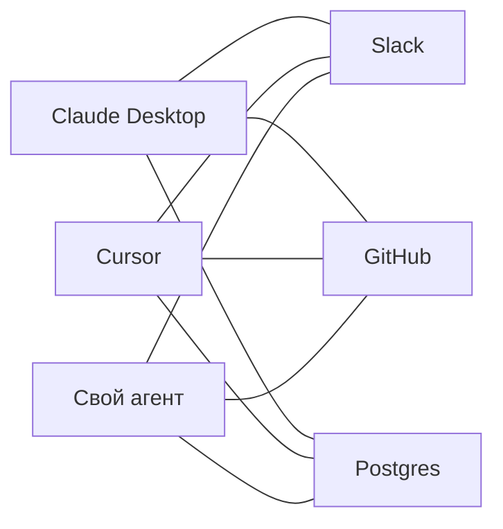
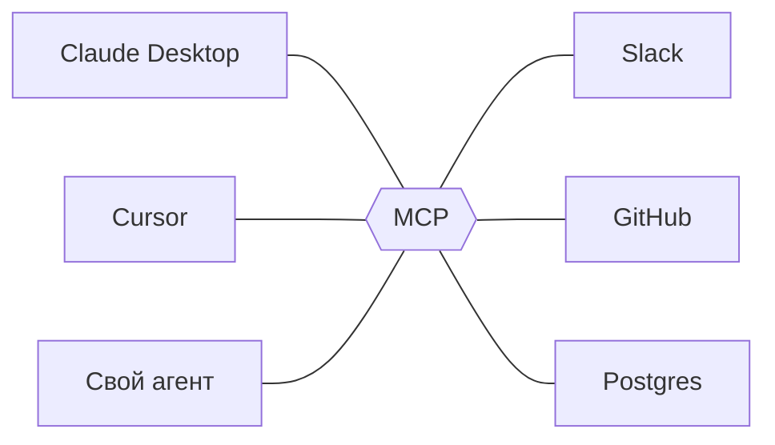

# MCP — практический гайд

От нуля до рабочего сервера на Python + FastMCP. Каждая следующая папка в `examples/` добавляет ровно **один** концепт поверх предыдущей — первый пример на ~20 строк, последний — полноценный HTTP-сервер с OAuth. Первые три главы этого документа читаются подряд, дальше можно прыгать в любой пример.

> **Версия спеки:** гайд опирается на актуальную ревизию **2025-11-25**. У протокола есть предыдущие (2024-11-05, 2025-03-26, 2025-06-18) и draft — основные концепты стабильны между ними, конкретные имена полей и мелкие правила иногда меняются. Направление развития — в разделе [куда копать дальше](#куда-копать-дальше).

> **Интерактивный разбор на уровне wire:** [mcp.muravskiy.com](https://mcp.muravskiy.com) — все сценарии гайда пошагово, как реальные JSON-RPC фреймы (handshake, tools/call, progress, sampling, OAuth, shutdown). Дополнение к тексту: теорию читаешь здесь, wire-трафик смотришь там.

## Оглавление

**Теория (читать по порядку):**
1. [Зачем MCP](#1-зачем-mcp)
   - [Сколько MCP весит в контексте](#сколько-mcp-весит-в-контексте)
2. [JSON-RPC за 10 минут](#2-json-rpc-за-10-минут)
3. [MCP до кода](#3-mcp-до-кода)

**Примеры (каждый — отдельная папка):**

4. [Hello MCP](#4-hello-mcp) → `examples/01-hello/`
5. [REST-обёртка](#5-rest-обёртка) → `examples/02-rest-wrapper/`
6. [Ошибки](#6-ошибки) → `examples/03-errors/`
7. [Prompts](#7-prompts) → `examples/04-prompts/`
8. [Resources](#8-resources) → `examples/05-resources/` 🚧 WIP
9. [Progress](#9-progress) → `examples/06-progress/` 🚧 WIP
10. [Cancellation](#10-cancellation) → `examples/07-cancellation/` 🚧 WIP
11. [Sampling](#11-sampling) → `examples/08-sampling/` 🚧 WIP
12. [Roots и Elicitation](#12-roots-и-elicitation) → `examples/09-roots-elicitation/` 🚧 WIP
13. [Streamable HTTP](#13-streamable-http) → `examples/10-http/` 🚧 WIP
14. [OAuth 2.1](#14-oauth-21) → `examples/11-oauth/` 🚧 WIP
15. [Security](#15-security) → `examples/12-security/` 🚧 WIP

**Appendix:**
- [ContextForge case study](#appendix-contextforge-case-study) → `appendix/contextforge/` 🚧 WIP
- [A2A case study](#appendix-a2a-case-study) → `appendix/a2a/` 🚧 WIP

> **Статус:** готовы главы 1–7; 8–15 и оба appendix — в работе, содержимое меняется.

---

## 1. Зачем MCP

**Проблема M×N.** До MCP каждый host решал интеграции по-своему — ChatGPT через plugins (потом Actions в GPTs), Claude и OpenAI API через function calling, IDE через собственные расширения. В итоге: каждое приложение с LLM (Cursor, Claude Desktop, свой агент) × каждый внешний сервис (Slack, GitHub, Postgres…) = квадратичная интеграционная боль.

**Без MCP — каждый клиент пишет адаптер к каждому сервису (3×3 = 9 адаптеров):**



**С MCP — каждая сторона реализует протокол один раз (3+3 = 6 реализаций):**



Шестиугольник MCP в середине — условность: никакого центрального прокси нет, MCP — это **общий протокол**.

**Прямой прецедент — LSP (Microsoft, 2016).** До LSP каждая IDE × каждый язык = N×M интеграций. LSP свёл к N+M. Anthropic явно взял LSP за образец: MCP — это «LSP для AI-инструментов».

Всё остальное в спеке — следствие этой идеи. Чтобы разные реализации могли разговаривать, нужен:

- общий **формат сообщений** (JSON-RPC 2.0),
- общий **словарь** (tools / resources / prompts / sampling / …),
- общий **handshake** (initialize + capability negotiation),
- общие **транспорты** (stdio, Streamable HTTP).

Дальше разберём каждый слой — сначала JSON-RPC, потом то, что MCP докручивает сверху. Но перед этим — одна важная оговорка.

---

## Сколько MCP весит в контексте

В 2025 в сообществе зазвучало: «MCP теряет актуальность, проще дать агенту shell и CLI-тулы». В этом есть правда — и её полезно понять честно, прежде чем учиться писать MCP-сервера.

**Суть проблемы.** У coding-агентов (Claude Code, Cursor) уже есть shell. Подключить к такому агенту десяток MCP-серверов — значит отдать заметную долю контекстного окна под описания инструментов ещё до того, как пользователь сказал первое слово ([замер Simon Willison](https://simonwillison.net/2025/Nov/4/code-execution-with-mcp/) на стандартной связке — порядка 48% контекста до первого сообщения). Плюс каждый результат tool'а проходит через контекст модели. А в shell `gh api ... | jq ...` — промежуточный JSON в контекст вообще не попадает. Это реальная экономика.

**На эту проблему уже есть три разных ответа** — и общее у всех одно: **поздняя загрузка**, не класть инструменты в контекст, пока они не понадобились.

- **Code execution with MCP** ([Anthropic, ноябрь 2025](https://www.anthropic.com/engineering/code-execution-with-mcp)). Оставить MCP-сервер как есть, но выставить его как ленивый code-level API, который модель импортирует по необходимости. На их примере — **150 000 → 2 000 токенов** на одной и той же задаче.
- **Skills** ([Anthropic](https://www.anthropic.com/news/skills)). Папки со скриптами и инструкциями, подгружаемые только тогда, когда пригодятся. Progressive disclosure на уровне каталога навыков.
- **Dynamic MCP hooks** ([AWS Strands](https://strandsagents.com/), [Google ADK](https://google.github.io/adk-docs/)). Сессия к MCP-серверу поднимается в момент вызова конкретного skill'а, используется и закрывается; в контексте остаётся только то, что нужно под текущую задачу. Middle ground: MCP как протокол — да, но каталог не грузится оптом.

**Но цена контекста — не единственная ось.** «Просто дай агенту shell» молчит про вторую проблему — **корпоративную инфраструктуру**. Возьмём внутреннего ассистента в крупной компании:

- **Через MCP** идут интеграции, которые живут в корпоративной плоскости: Jira, GitLab, BigQuery, внутренний сервис-каталог, HR-система. Им нужен **SSO** (OAuth 2.1 с корпоративным IdP — Keycloak, Active Directory), **аудит** (кто и какой tool звал в каком контексте), **централизованное управление** (админ включает коннектор один раз — он появляется сразу у всех клиентов: Claude Desktop у разработчиков, Cursor, свой веб-агент, Slack-бот). CLI под Jira каждый собирал бы сам, протаскивая токен через переменные окружения — security-дыра и хаос в управлении.
- **Через shell** идёт то, что уже живёт как CLI и корпоративной плоскости не требует: `git`, `pytest`, `terraform`, внутренний `deploy`-скрипт, `grep` по репозиторию, одноразовая Python-команда для разведки. Делать под каждое MCP-сервер — работа без выгоды, и токены улетят в никуда.

**Итог — две оси, а не одна:**

- По **цене контекста** shell часто выигрывает. Если цена давит — применяй один из трёх паттернов поздней загрузки, прежде чем отказываться от MCP.
- По **корпоративной инфраструктуре** (auth + audit + policy + несколько клиентов к одной интеграции) у MCP нет конкурентов.

В настоящем агенте MCP и shell соседствуют — это нормальный паттерн, не компромисс. Дальше в гайде мы учимся писать MCP-сервера; а когда будешь строить своего агента, про каждую интеграцию спрашивай себя по обеим осям: сколько это весит в контексте и нужна ли для этого корп-плоскость.

---

## 2. JSON-RPC за 10 минут

MCP — это тонкий профиль поверх **JSON-RPC 2.0**. Если JSON-RPC не сидит в голове, в MCP будет казаться много магии там, где её нет. Поэтому сначала базовый уровень.

### Что это и чем не является

JSON-RPC 2.0 — **stateless transport-agnostic** формат JSON-сообщений для RPC. Три важных свойства:

- Описывает **только формат сообщений** и правила их обработки.
- Ничего не знает про транспорт (TCP, HTTP, stdio — что угодно), аутентификацию, сессии, схемы параметров, streaming.
- **Симметричен** — на уровне протокола нет «клиента» и «сервера», есть только отправитель и получатель.

Последний пункт критичен для MCP: запросы идут **в обе стороны**. Например, `sampling/createMessage` — это запрос, который **сервер** отправляет **клиенту**. Любой peer должен уметь быть и отправителем, и отвечающим.

### Три типа сообщений

**Request** — ожидает ответ, обязан иметь `id`:
```json
{"jsonrpc": "2.0", "method": "tools/call", "params": {...}, "id": 42}
```

**Response** — ответ на request. Содержит **либо** `result`, **либо** `error`, не оба:
```json
{"jsonrpc": "2.0", "result": {...}, "id": 42}
```
```json
{"jsonrpc": "2.0", "error": {"code": -32601, "message": "Method not found"}, "id": 42}
```

**Notification** — request **без `id`**, ответа не ожидает:
```json
{"jsonrpc": "2.0", "method": "notifications/initialized"}
```

Всё. Любое MCP-сообщение — это одно из этих трёх.

### Поле `id` — корреляция ответов

- Тип: string или integer (дробные и `null` не используем).
- Отвечающий **обязан echo-ить** ровно тот же `id` обратно, включая тип (прислали `"42"` строкой — вернуть надо строку).
- **Отсутствие** поля `id` = notification. Это **не то же самое**, что `"id": null`.
- Отправитель обеспечивает уникальность `id` в рамках сессии (обычно монотонный счётчик).

MCP ужесточает JSON-RPC в одном месте: `id` **не должен быть null** и **не должен повторяться** в рамках сессии.

Ответы могут прийти **не в порядке запросов**. Если клиент послал long-running `tools/call` с id=3 и следом быстрый `resources/read` с id=4, сервер вправе ответить сначала на id=4. Поэтому отправитель держит таблицу `id → pending`.

### `params`

- Может быть **полностью опущен**, если метод без параметров.
- Если присутствует — это **объект** (by-name) или массив (by-position). Не примитив.
- MCP **всегда by-name**. Массивов в MCP не увидишь.

### Ошибки

```json
{"code": -32601, "message": "Method not found", "data": {...}}
```

Зарезервированные коды:

| Код | Что значит |
|---|---|
| `-32700` | Parse error (невалидный JSON) |
| `-32600` | Invalid Request (JSON валидный, но не JSON-RPC request) |
| `-32601` | Method not found |
| `-32602` | Invalid params |
| `-32603` | Internal error |
| `-32000..-32099` | server-defined |

**Важный нюанс, на котором можно сломаться:** JSON-RPC errors — это **транспортные** ошибки (метод не найден, параметры невалидны, процесс упал). Ошибки **бизнес-логики инструмента** в MCP возвращаются как **успешный `result`** с полем `isError: true`. Это намеренно — чтобы модель могла увидеть ошибку как часть разговора и среагировать. Подробно разберём в `examples/03-errors/`.

### Notifications — подводные камни

- Получатель **никогда** не отвечает на notification. Даже если парсинг упал — никакого response.
- Отправитель notification **никогда не узнаёт** об ошибке на стороне получателя. Это fire-and-forget.
- В MCP все имена notification-методов по конвенции начинаются с `notifications/`: `notifications/initialized`, `notifications/cancelled`, `notifications/progress`, `notifications/tools/list_changed`.

### Что JSON-RPC не даёт — и что MCP докручивает

| JSON-RPC не определяет | MCP определяет |
|---|---|
| Транспорт | stdio и Streamable HTTP |
| Framing на stream-транспорте | newline-delimited JSON на stdio |
| Сессии | lifecycle (initialize → initialized → operation → shutdown) |
| Capability discovery | capability negotiation в `initialize` |
| Схема параметров | `schema.ts` + JSON Schema для tools |
| Версионирование | `protocolVersion` в initialize, `MCP-Protocol-Version` header на HTTP |

Batching (массив запросов в одном сообщении) формально в JSON-RPC есть, но в MCP его **нет**: был добавлен в ревизии 2025-03-26 и удалён в 2025-06-18 как слишком сложный без соразмерной пользы. В MCP-коде его не увидишь — обрабатывай только одиночные сообщения.

---

## 3. MCP до кода

Теперь словарь, который нужен, чтобы читать примеры.

### Три роли: host, client, server

- **Host** — приложение, внутри которого живёт LLM (Claude Desktop, Cursor, твой агент).
- **Client** — компонент внутри host'а, держащий **одно** соединение с **одним** сервером. Host может иметь много client'ов параллельно.
- **Server** — процесс, который предоставляет tools/resources/prompts. Один сервер = один набор возможностей.

Частая ошибка — путать host и client. Claude Desktop — это host. Его встроенный MCP-клиент — это client. Один host содержит много clients (по одному на каждый подключённый сервер).

### Lifecycle сессии

Строгий порядок. До завершения initialize **нельзя ничего другого делать**:

1. Client → Server: `initialize` (request) — «предлагаю версию X, вот мои capabilities».
2. Server → Client: response — «принимаю версию Y, вот мои capabilities».
3. Client → Server: `notifications/initialized` — «handshake закончен, готов».
4. **Operation phase** — запросы в обе стороны по заявленным capabilities.
5. **Shutdown** — на stdio просто закрытие stdin сервера (сервер видит EOF и завершается); на HTTP — DELETE на session endpoint.

Тонкость, на которой часто спотыкаются: `initialized` — это **не ответ** на `initialize`. На `initialize` (request с id) приходит response. А `initialized` — **отдельное** сообщение, уже notification (без id), которую клиент шлёт после получения response.

Ещё деталь про версию: это строка-дата ревизии спеки (`"2025-11-25"`). Клиент в `initialize` предлагает ту, что знает; сервер может **согласиться или downgrade-нуть** на более старую, которую сам поддерживает. Если пересечения нет — сессия не поднимается. Этот гайд опирается на `2025-11-25`; на более старых ревизиях имена некоторых полей и мелкие правила будут отличаться.

### Capability negotiation

В `initialize` обе стороны объявляют, что они умеют:

- **Client capabilities**: `roots`, `sampling`, `elicitation` — фичи, на которые сервер может рассчитывать.
- **Server capabilities**: `tools`, `resources`, `prompts`, `logging` — фичи, которые сервер предоставляет.

Правило: если сервер не объявил `tools`, звать `tools/list` — ошибка протокола. Клиент **не имеет права** вызывать то, о чём сервер не заявил. Это и есть negotiation.

Многие gateway-обёртки ломаются именно здесь — пробрасывают запросы вслепую и в итоге либо теряют фичи, либо зовут то, чего нет. Конкретный разбор на примере [IBM ContextForge](https://github.com/IBM/mcp-context-forge) (популярный open-source MCP-gateway) — в [Appendix: ContextForge case study](#appendix-contextforge-case-study): он возвращает клиенту **захардкоженный** набор capabilities, не глядя на downstream-серверы вообще.

### Протокол симметричен

Запросы идут **в обе стороны**. Примеры server → client:

- `sampling/createMessage` — сервер просит host прогнать prompt через LLM.
- `elicitation/create` — сервер просит у пользователя структурированное уточнение.
- `roots/list` — сервер спрашивает, какие директории/URI он видит.

Это прямое следствие симметрии JSON-RPC. Живьём увидим в `examples/08-sampling/`.

### Три server primitives

- **Tools** — действия, которые LLM может вызвать (function calling). **Модель решает**, когда звать.
- **Resources** — читаемые данные (файлы, записи БД, URL). Подписка на изменения через `notifications/resources/updated`. Обычно выбирает **приложение**, а не модель.
- **Prompts** — параметризованные шаблоны, которые пользователь явно выбирает из меню (slash-команды в UI клиента).

Правило выбора между tool и resource: если **LLM сама решает, когда дёрнуть** — tool; если **приложение показывает пользователю или подшивает в контекст** — resource.

Где разбирается:

| Примитив | Где |
|---|---|
| **Tools** | [`01-hello`](examples/01-hello/) базовый вызов · [`02-rest-wrapper`](examples/02-rest-wrapper/) схема параметров и content blocks · [`03-errors`](examples/03-errors/) ошибки · [`06-progress`](examples/06-progress/) прогресс · [`07-cancellation`](examples/07-cancellation/) отмена |
| **Resources** | [`05-resources`](examples/05-resources/) |
| **Prompts** | [`04-prompts`](examples/04-prompts/) |

### Три client features

- **Sampling** — сервер может попросить клиента прогнать prompt через LLM. Позволяет серверу строить агентные паттерны без своей LLM-подписки.
- **Roots** — клиент сообщает серверу, какие файлы/URI он «видит» (workspace, открытые проекты).
- **Elicitation** — сервер может запросить у пользователя структурированный ввод в середине операции.

Где разбирается:

| Фича | Где |
|---|---|
| **Sampling** | [`08-sampling`](examples/08-sampling/) |
| **Roots** | [`09-roots-elicitation`](examples/09-roots-elicitation/) |
| **Elicitation** | [`09-roots-elicitation`](examples/09-roots-elicitation/) |

### Два транспорта

- **stdio** — сервер запускается как child process клиента, общение через stdin/stdout, логи в stderr. Прост, локален, без auth — доверие задаётся тем, кто запустил процесс. Первые примеры все на stdio.
- **Streamable HTTP** — один HTTP endpoint, POST для отправки, опциональный SSE-upgrade для серверных уведомлений. Сессии через `Mcp-Session-Id` header, resumability через `Last-Event-ID`. Для сети, multi-tenant, OAuth. Разберём в `examples/10-http/` и `examples/11-oauth/`.

### Что дальше

Словарь есть. Идём в `examples/01-hello/` и смотрим, что там под капотом.

---

## 4. Hello MCP

📁 [`examples/01-hello/`](examples/01-hello/)

Минимальный FastMCP-сервер с одним tool `echo`. Запускаем через MCP Inspector, ловим сырые JSON-RPC фреймы `initialize` → `initialized` → `tools/list` → `tools/call`. Цель: увидеть теорию из [JSON-RPC](#2-json-rpc-за-10-минут) и [MCP до кода](#3-mcp-до-кода)

## 5. REST-обёртка

📁 [`examples/02-rest-wrapper/`](examples/02-rest-wrapper/)

Оборачиваем учебный REST API задач в MCP. `inputSchema` из Python type hints, content blocks, `structuredContent` для структурированных ответов.

## 6. Ошибки

📁 [`examples/03-errors/`](examples/03-errors/)

Протокольные ошибки (`-32602`) vs бизнес-ошибки (`result` с `isError: true`). Почему это два разных механизма и когда какой.

## 7. Prompts

📁 [`examples/04-prompts/`](examples/04-prompts/)

Prompt-шаблоны с аргументами. Как они появляются в UI клиента (slash-команды) и чем отличаются от tools.

## 8. Resources 🚧 WIP

📁 [`examples/05-resources/`](examples/05-resources/)

Те же задачи, но как resources, а не tools. Subscribe, `notifications/resources/list_changed`, `notifications/resources/updated`. Когда выбирать resource вместо tool.

## 9. Progress 🚧 WIP

📁 [`examples/06-progress/`](examples/06-progress/)

Long-running tool, который шлёт `notifications/progress` через `_meta.progressToken`. Первый реальный bidirectional flow в проекте.

## 10. Cancellation 🚧 WIP

📁 [`examples/07-cancellation/`](examples/07-cancellation/)

Отмена tool call через `notifications/cancelled`. Race conditions, graceful shutdown внутри tool'а.

## 11. Sampling 🚧 WIP

📁 [`examples/08-sampling/`](examples/08-sampling/)

Сервер отправляет request **клиенту**, просит прогнать prompt через LLM. Здесь симметричность протокола из §3 перестаёт быть теорией.

## 12. Roots и Elicitation 🚧 WIP

📁 [`examples/09-roots-elicitation/`](examples/09-roots-elicitation/)

Оставшиеся client-фичи. Сервер видит workspace пользователя и просит у него структурированное уточнение в середине операции.

## 13. Streamable HTTP 🚧 WIP

📁 [`examples/10-http/`](examples/10-http/)

Тот же tasks-сервер, но на HTTP. `Mcp-Session-Id`, SSE-upgrade, `MCP-Protocol-Version` header, resumability через `Last-Event-ID`.

## 14. OAuth 2.1 🚧 WIP

📁 [`examples/11-oauth/`](examples/11-oauth/)

Добавляем авторизацию к HTTP-серверу. PKCE, dynamic client registration (RFC 7591), discovery через `.well-known/oauth-protected-resource`.

## 15. Security 🚧 WIP

📁 [`examples/12-security/`](examples/12-security/)

Prompt injection через tool description, tool shadowing между серверами, confused deputy. Демо атак на собственном сервере — чтобы увидеть глазами.

---

## Appendix: ContextForge case study 🚧 WIP

📁 [`appendix/contextforge/`](appendix/contextforge/)

Что популярный MCP-gateway теряет при проксировании. Опирается на §3 (capability negotiation, симметрия) и на `examples/08-sampling/` — читается после основной части.

## Appendix: A2A case study 🚧 WIP

📁 [`appendix/a2a/`](appendix/a2a/)

Сравнение MCP с Agent-to-Agent Protocol (Google). Где MCP концептуально слаб, что именно Tasks SEP пытается закрыть и когда имеет смысл использовать оба протокола рядом.

---

## Куда копать дальше

- **Спека**: [modelcontextprotocol/modelcontextprotocol](https://github.com/modelcontextprotocol/modelcontextprotocol), актуальная ревизия `schema/2025-11-25/schema.ts` — канонический источник истины, вся Markdown-документация сгенерирована вокруг него.
- **SDK**: [typescript-sdk](https://github.com/modelcontextprotocol/typescript-sdk) (ближе к спеке), [python-sdk](https://github.com/modelcontextprotocol/python-sdk) с FastMCP (используем здесь).
- **Inspector**: [modelcontextprotocol/inspector](https://github.com/modelcontextprotocol/inspector) — обязательный инструмент, подключается к любому серверу и показывает wire-трафик в обе стороны.
- **JSON-RPC 2.0 spec**: [jsonrpc.org/specification](https://www.jsonrpc.org/specification) — 4 страницы, 15 минут.

### Куда движется протокол

Развитие идёт через **Working Groups** и **SEPs** (Specification Enhancement Proposals) в основном репозитории. Самые заметные активные направления:

- **SEP-1686 — Tasks primitive.** Асинхронные длинные операции с retry/expiry/resume — закрывает область, где MCP исторически был слаб (см. [сравнение с A2A](#appendix-a2a-case-study)).
- **Server Cards** — `.well-known`-метаданные сервера (описание, авторы, политика использования), чтобы host'ы могли показывать понятную карточку пользователю до подключения.
- **Skills over MCP** (experimental) — интеграция Anthropic Skills как типа серверного контента.
- **2026 roadmap** — transport scalability, horizontal scaling stateful-сессий, governance, enterprise readiness.

Где следить: [blog.modelcontextprotocol.io](https://blog.modelcontextprotocol.io/) (официальный блог), [issues и discussions в modelcontextprotocol/modelcontextprotocol](https://github.com/modelcontextprotocol/modelcontextprotocol), [2026 roadmap-пост](https://blog.modelcontextprotocol.io/posts/2026-mcp-roadmap/). Любая Markdown-спека к моменту чтения может быть на пол-шага позади — в сомнительных случаях смотри `schema.ts` в draft-ветке.
