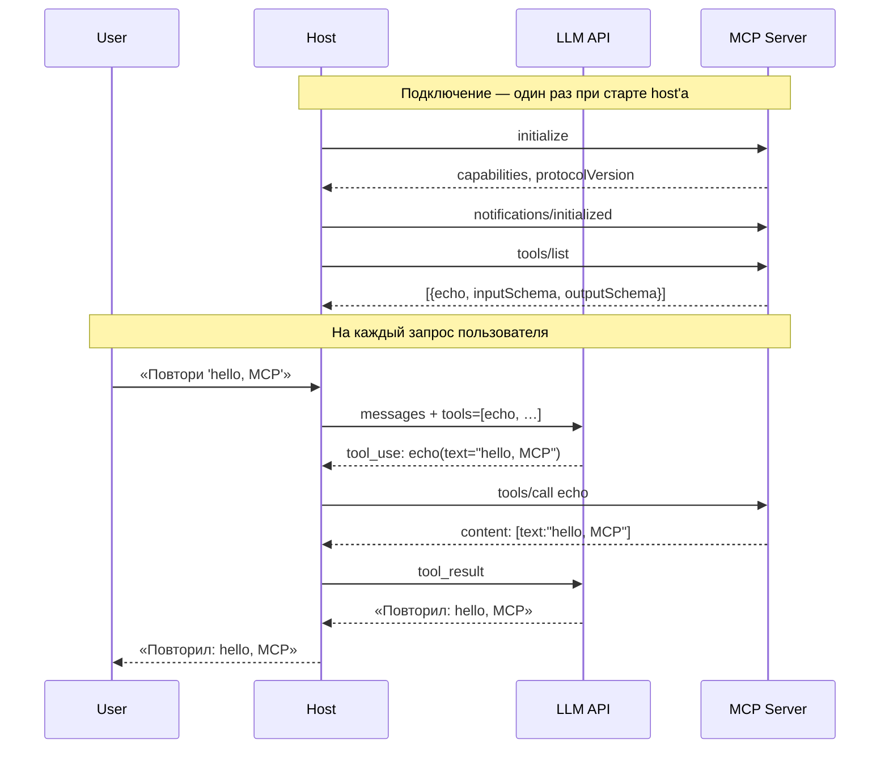

# 01 — Hello MCP

Минимальный FastMCP-сервер с одним tool `echo`. Цель — увидеть полный handshake и первый tool call в **реальных** JSON-RPC сообщениях, а не в пересказе спеки.

## Содержимое папки

```
01-hello/
├── pyproject.toml    # одна зависимость: mcp
├── server.py         # сервер, 10 строк
├── demo.py           # интерактивный клиент: гоняет сервер через lifecycle и печатает весь wire
└── README.md         # этот файл
```

## Установка

```bash
uv sync
```

Создаст `.venv/` в этой папке, поставит `mcp` и его зависимости. Один раз.

## server.py

```python
from mcp.server.fastmcp import FastMCP

mcp = FastMCP("hello")


@mcp.tool()
def echo(text: str) -> str:
    """Return the input text unchanged."""
    return text


if __name__ == "__main__":
    mcp.run()
```

Десять строк. FastMCP за нас:

- читает stdin построчно, парсит JSON-RPC,
- из Python type hints (`text: str`, `-> str`) генерирует `inputSchema` и `outputSchema`,
- ловит handshake, отвечает на `tools/list`, роутит `tools/call` в нужную функцию.

Сервер по **stdio** — читает JSON-RPC из stdin, пишет ответы в stdout. Запускать напрямую в терминале бессмысленно: будет висеть в ожидании. Нужен клиент.

## Запуск и wire-разбор через `demo.py`

`demo.py` — простейший Python-клиент, ~90 строк stdlib. Он стартует `server.py` как child-процесс и шлёт ему по очереди все четыре сообщения lifecycle, **целиком печатая** каждый JSON в обе стороны. Между шагами — пауза до `Enter`.

```bash
uv run python demo.py
```

Пройдёмся по выводу. Обозначения: `>>>` — клиент → сервер, `<<<` — сервер → клиент.

### Шаг 1 — initialize

Клиент первым делом шлёт request `initialize`. До получения ответа больше ничего отправлять нельзя.

**Request:**

```json
>>> {
  "jsonrpc": "2.0",
  "method": "initialize",
  "params": {
    "protocolVersion": "2025-11-25",
    "capabilities": {},
    "clientInfo": {
      "name": "demo",
      "version": "0.1.0"
    }
  },
  "id": 1
}
```

- `"jsonrpc": "2.0"` — **обязательное** поле в каждом JSON-RPC сообщении (и запросе, и ответе, и notification). Указывает, что сообщение соответствует спецификации JSON-RPC версии 2.0. Других значений не бывает; без этого поля сообщение невалидно.
- `"protocolVersion": "2025-11-25"` — ревизия **MCP-спеки**, которую **предлагает клиент**. Не путать с `jsonrpc` выше: `jsonrpc` — версия транспортного протокола JSON-RPC, `protocolVersion` — версия MCP поверх него. Сервер может согласиться или предложить downgrade.
- `"capabilities": {}` — что умеет **клиент**. Пустой: наш демо не заявляет `roots`, `sampling` или `elicitation`. Сервер этим не пользуется.
- `"clientInfo"` — имя и версия клиента, для логов. На логику не влияет.
- `"id": 1` — это request, ждём response с тем же id.

**Response:**

```json
<<< {
  "jsonrpc": "2.0",
  "id": 1,
  "result": {
    "protocolVersion": "2025-11-25",
    "capabilities": {
      "experimental": {},
      "prompts": {
        "listChanged": false
      },
      "resources": {
        "subscribe": false,
        "listChanged": false
      },
      "tools": {
        "listChanged": false
      }
    },
    "serverInfo": {
      "name": "hello",
      "version": "1.27.0"
    }
  }
}
```

- `"id": 1` — сервер echo-нул тот же id (JSON-RPC correlation).
- `"protocolVersion": "2025-11-25"` — согласен с предложением. Если бы сервер не умел эту ревизию, вернул бы свою максимальную; клиент тогда решал бы, продолжать сессию или нет.
- `"capabilities"` — что умеет **сервер**. Мы в коде описали только `echo`, но FastMCP заявил ещё `prompts` и `resources`, хотя их у нас нет. По [спеке](https://github.com/modelcontextprotocol/modelcontextprotocol/blob/main/schema/2025-11-25/schema.ts#L388-L431) каждая capability должна быть **«Present if the server offers any...»** — объявлять только реально реализованное. **Это специфическое отступление FastMCP в Python SDK**, а не общая SDK-практика: в [`_setup_handlers`](https://github.com/modelcontextprotocol/python-sdk/blob/v1.27.0/src/mcp/server/fastmcp/server.py#L302) он безусловно регистрирует все три list-хэндлера, и поэтому в capability всегда попадают `prompts`, `resources` и `tools`. Для сравнения, [TypeScript SDK](https://github.com/modelcontextprotocol/typescript-sdk/blob/v1.29.0/src/server/mcp.ts#L124-L136) делает это **правильно**: handler'ы и capabilities регистрируются лениво только при первом `.registerTool()` / `.registerResource()` / `.registerPrompt()`. Тематического issue в python-sdk по этой теме нет — ни PR, ни исправления. На работу не влияет (клиент позовёт `prompts/list` и получит пустой список), но в строгих прод-проектах стоит держать в голове.
- **Флаг `"listChanged"` внутри каждой capability.** Сервер так говорит клиенту, **статичен ли каталог tool'ов / prompts / resources** в течение сессии. `false` — не меняется, клиент может один раз закэшировать `tools/list` и не перезапрашивать. `true` — сервер обещает присылать уведомление при изменении, и клиент тогда заново дёргает `tools/list`. У нашего `echo`-сервера каталог статичный, поэтому корректно `false`. Механику «сервер прислал notification → клиент перезапросил список» разберём в [`04-resources/`](../04-resources/), там это работает нагляднее.
- `"experimental": {}` — слот для расширений за пределами спеки.
- `"serverInfo.version": "1.27.0"` — это версия пакета `mcp`, а не нашего сервера. Ещё один FastMCP-дефолт; в настоящем проекте стоит подставлять свою.

### Шаг 2 — notifications/initialized

Клиент подтверждает, что готов работать.

```json
>>> {
  "jsonrpc": "2.0",
  "method": "notifications/initialized"
}
```

Два тонких момента, на которых часто спотыкаются:

- **Нет поля `id`** — это notification, ответа не будет. И это **не то же самое**, что `"id": null`.
- **Это не response** на initialize. Response на initialize уже пришёл в шаге 1. А вот это — отдельное сообщение: «твой response я получил, перехожу в operation phase». По спеке только после него клиенту и серверу разрешено слать операционные запросы.

Сервер обрабатывает notification молча — в выводе demo под шагом 2 блока `<<<` нет.


### Шаг 3 — tools/list

Клиент спрашивает, какие tool'ы у сервера.

**Request:**

```json
>>> {
  "jsonrpc": "2.0",
  "method": "tools/list",
  "id": 2
}
```

`params` опущены — для этого метода они опциональные. Если у сервера много tool'ов, здесь появится `cursor` для пагинации (разберём в [`04-resources/`](../04-resources/)).

**Response:**

```json
<<< {
  "jsonrpc": "2.0",
  "id": 2,
  "result": {
    "tools": [
      {
        "name": "echo",
        "description": "Return the input text unchanged.",
        "inputSchema": {
          "properties": {
            "text": {
              "title": "Text",
              "type": "string"
            }
          },
          "required": [
            "text"
          ],
          "title": "echoArguments",
          "type": "object"
        },
        "outputSchema": {
          "properties": {
            "result": {
              "title": "Result",
              "type": "string"
            }
          },
          "required": [
            "result"
          ],
          "title": "echoOutput",
          "type": "object"
        }
      }
    ]
  }
}
```

- `"name": "echo"` — имя Python-функции один-в-один.
- `"description": "Return the input text unchanged."` — docstring. Это то, что **видит LLM**, когда решает, какой tool дёрнуть. Плохой docstring → плохие вызовы.
- `"inputSchema"` — чистый JSON Schema draft-07, FastMCP сгенерировал из type hints. Параметр `text: str` без default → `type: "string"` + `required: ["text"]`.
- `"outputSchema"` — симметрично, из `-> str`. Фича появилась в ревизии 2025-06-18; описывает ожидаемую форму `structuredContent` в ответе на `tools/call` (шаг 4).

### Шаг 4 — tools/call

Клиент зовёт `echo` с аргументом.

**Request:**

```json
>>> {
  "jsonrpc": "2.0",
  "method": "tools/call",
  "params": {
    "name": "echo",
    "arguments": {
      "text": "hello, MCP"
    }
  },
  "id": 3
}
```

`arguments` — объект by-name. Массивов (by-position) в MCP не бывает, хотя JSON-RPC это формально разрешает.

**Response:**

```json
<<< {
  "jsonrpc": "2.0",
  "id": 3,
  "result": {
    "content": [
      {
        "type": "text",
        "text": "hello, MCP"
      }
    ],
    "structuredContent": {
      "result": "hello, MCP"
    },
    "isError": false
  }
}
```

Две формы одного результата — не случайность:

- `"content"` — массив **content-блоков**. Каждый со своим `type` (`text`, `image`, `resource`, `resource_link`, `audio`). Это то, что попадает в контекст модели как часть разговора. LLM видит именно блоки.
- `"structuredContent"` — структурированный JSON, соответствующий `outputSchema` из шага 3. Нужен, когда ответ надо обработать детерминированно (UI, следующий tool, сам агент) без парсинга строки. Две формы — не дублирование, а две роли: `content` — для модели, `structuredContent` — для кода.
- `"isError": false` — явное указание, что бизнес-операция успешна. Если бы `echo` бросил исключение, здесь было бы `true`, но с точки зрения JSON-RPC вызов всё равно считался бы успешным. Подробнее — в [`03-errors/`](../03-errors/).

---

## Как это попадает в контекст модели

Всё, что мы сейчас увидели через `demo.py`, **делает каждый MCP-клиент** — Claude Desktop, Cursor, Copilot, твой собственный агент на Strands или ADK, Slack-бот со встроенным host'ом. Просто обычно они делают это без UI, без пауз и без принтов. `demo.py` — это тот же клиент, просто упрощённый и явный.

Полная картина от «MCP-сервер подключили» до «модель использует `echo` в ответе пользователю»:



Обрати внимание: `tools=[echo, …]` во второй фазе — это **тот самый** ответ на `tools/list` из первой. Host один раз при подключении собирает каталог, а дальше на каждом пользовательском запросе встраивает его в сообщение к LLM. Отсюда же расходы на контекст, про которые [§1.5 главного README](../../README.md#сколько-mcp-весит-в-контексте).

Текстом — те же арки, разбитые на семь смысловых шагов:

1. **Host запускает сервер.** При старте Claude Desktop (или любого другого host'а) спавнит твой `server.py` как child process, проходит handshake (шаги 1–2 из demo), зовёт `tools/list` (шаг 3). Ответ парсится.
2. **`tools/list` превращается в function definitions для LLM.** `name` + `description` + `inputSchema` каждого tool'а напрямую ложатся в формат tool-use того API, который host использует (Anthropic Messages API, OpenAI chat.completions и т. п.). Каждый MCP tool становится «функцией», которую модель может позвать.
3. **Эти function definitions отправляются в модель при каждом запросе.** Вот откуда берётся «MCP ест контекст» из [§ Сколько MCP весит в контексте](../../README.md#сколько-mcp-весит-в-контексте): `description` и `inputSchema` каждого tool'а встроены в системный промпт на каждый turn.
4. **Модель решает позвать `echo`.** В своём ответе она возвращает специальный tool-use блок: «хочу вызвать `echo` с аргументом `text: "..."`».
5. **Host ловит tool-use и делает MCP `tools/call`** (шаг 4 из demo) с теми же аргументами. Получает response с `content` и `structuredContent`.
6. **Host возвращает `content` в модель** как tool-result. Модель видит результат в контексте и продолжает reasoning. `structuredContent` модели **не передаётся** — оно предназначено самому host'у (UI, следующие tool'ы, автоматизация).
7. **Модель пишет финальный ответ пользователю** — уже с учётом того, что вернул `echo`.

### Как это выглядит в OpenAI-compatible API

Чтобы связка стала осязаемой — возьмём самый распространённый формат, OpenAI `/v1/chat/completions`. Host, получив ответ на `tools/list` (шаг 3), собирает такой запрос к модели:

```json
POST /v1/chat/completions
{
  "model": "gpt-4o",
  "messages": [
    {"role": "user", "content": "Повтори фразу 'hello, MCP'"}
  ],
  "tools": [
    {
      "type": "function",
      "function": {
        "name": "echo",
        "description": "Return the input text unchanged.",
        "parameters": {
          "type": "object",
          "properties": {
            "text": {"type": "string", "title": "Text"}
          },
          "required": ["text"]
        }
      }
    }
  ]
}
```

Это **прямой перенос** нашего `tools/list` ответа — сравни с шагом 3:

- `name` → `function.name`
- `description` → `function.description`
- `inputSchema` → `function.parameters` (только имя переименовано; содержимое — тот же JSON Schema)

Модель решает позвать `echo`, отвечает с `tool_calls`:

```json
{
  "choices": [{
    "message": {
      "role": "assistant",
      "tool_calls": [
        {
          "id": "call_abc123",
          "type": "function",
          "function": {
            "name": "echo",
            "arguments": "{\"text\":\"hello, MCP\"}"
          }
        }
      ]
    }
  }]
}
```

Host ловит `tool_calls[0]`, парсит `arguments` из строки в объект, делает MCP `tools/call` (наш шаг 4), получает `content: [{"type": "text", "text": "hello, MCP"}]`. Дальше шлёт модели следующее сообщение с ролью `tool`:

```json
{
  "role": "tool",
  "tool_call_id": "call_abc123",
  "content": "hello, MCP"
}
```

И модель пишет финальный ответ пользователю.

Anthropic Messages API устроен аналогично: `tools` с теми же `name` + `description` + `input_schema` (у Anthropic имя совпадает с MCP!), в ответе — `tool_use` content блок, а tool-result приходит обратно как `tool_result` блок с тем же `tool_use_id`. Идейно одно и то же — разные имена полей.

### Что модель никогда не видит

`jsonrpc`, `id`, `capabilities`, `serverInfo`, session-id, `protocolVersion`, любые notifications. Это всё транспортный уровень. Модель работает только с двумя вещами: function-definitions из `tools/list` и tool-results из `content` блоков `tools/call`.

Полезное следствие: качество работы модели с твоим MCP-сервером на **90% определяется качеством `description` и `inputSchema`** твоих tool'ов. Это то, что реально попадает в её контекст. Реализация внутри сервера, транспорт, capabilities — всё это важно для корректности, но для «умеет ли модель этим пользоваться» решает именно текст, который она увидит в tools/list.

---

## А теперь — MCP Inspector

[MCP Inspector](https://github.com/modelcontextprotocol/inspector) — официальный дебаггер с веб-интерфейсом. Это **то, чем реально пользуются** при работе с MCP: подключают свой Claude Desktop, чужие сервера, свои агенты, проверяют, что tool'ы регистрируются. Полезно уметь им пользоваться. Как учебный инструмент он хуже `demo.py` — скрывает детали протокола за UI, — но как рабочий тул незаменим.

```bash
npx @modelcontextprotocol/inspector uv run python server.py
```

Откроется вкладка браузера. Нажми **Connect** → таб **Tools** → **List Tools** → выбери `echo` → задай `text` → **Run Tool**. В панели **History** увидишь пары request+response. Чтобы раскрыть свёрнутые строки — кликай по ним (params развернутся в JsonView).

**Три места, где Inspector обманывает или скрывает реальность:**

1. **Не пишет envelope-поля** (`jsonrpc`, `id`) и обрезает длинные значения на 100 символов. Это [by design](https://github.com/modelcontextprotocol/inspector/issues/352).
2. **Не показывает client→server notifications.** History — это только пары request+response. А у notifications нет response. Например, `notifications/initialized` (шаг 2 из demo) клиент отправляет **обязательно** — иначе сервер не перейдёт в operation phase — но в UI её нет нигде.
3. **Панель `Server Notifications` синтезирует нотификации из stderr.** Inspector читает stderr сервера и каждую строку оборачивает в псевдо-`notifications/message` с `logger: "stdio"`. Это удобно для дебага (видишь серверные логи прямо в UI), но **не настоящие** MCP-notifications — по JSON-RPC ничего такого не летит. Настоящее MCP-логирование работает иначе: сервер должен объявить `logging` capability и слать structured notifications по запросу клиента. Разберём в [`06-progress/`](../06-progress/).

После прохождения demo эти искажения легко читаются: «А, здесь Inspector спрятал envelope, но в demo я видел, что там `id: 3`». Без demo они путают на ровном месте.

## Что потрогать

1. **Попробуй странную версию.** В `demo.py` замени `"protocolVersion": "2025-11-25"` на `"1999-01-01"` и запусти. Посмотри, что вернёт сервер.
2. **Убери docstring** у `echo` в `server.py` и пройдись demo снова. `description` в `tools/list` исчезнет — LLM будет видеть tool без подсказок.
3. **Добавь второй параметр с default**: `def echo(text: str, repeat: int = 1) -> str`. Пройдись demo, посмотри на `inputSchema` и `required`.
4. **Покажи stderr сервера.** В `demo.py` замени `stderr=subprocess.DEVNULL` на `stderr=subprocess.STDOUT`. Увидишь те же строки `Processing request of type...`, которые Inspector оборачивает в синтетические «server notifications». Наглядно: это не протокол, это просто stderr.

## Что разобрали

| Концепт | Где в wire |
|---|---|
| Три типа JSON-RPC сообщений | request (шаги 1, 3, 4), response (в каждой паре), notification (шаг 2) |
| id-корреляция | id=1 ↔ response c id=1; id=2 ↔ id=2; id=3 ↔ id=3 |
| Notification без `id` | шаг 2: поле `id` физически отсутствует в сообщении |
| Lifecycle: initialize → initialized → operation | шаги 1 → 2 → 3, 4 |
| Capability negotiation | `capabilities` в шаге 1 с обеих сторон |
| Content blocks | `content: [{type: "text", ...}]` в шаге 4 |
| structuredContent | шаг 4, рядом с `content` |
| stdio framing | каждое сообщение — одна строка JSON + `\n` |

Дальше — [`02-rest-wrapper/`](../02-rest-wrapper/): оборачиваем реальный REST-сервис, смотрим более богатые content blocks и tool annotations.