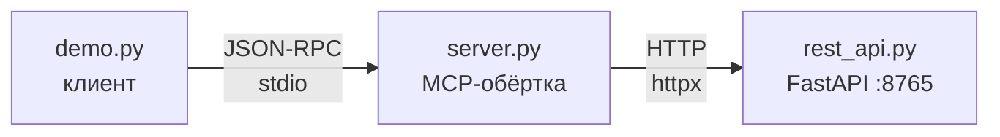

# 02 — REST-обёртка

Типичный корпоративный сценарий: есть **REST-сервис**, нужно дать к нему доступ агенту. Пишем MCP-обёртку.

Показывает два новых относительно [`01-hello`](../01-hello/) концепта:

- **Tool annotations** — подсказки LLM и host'у о природе операции (readOnly / destructive / idempotent / openWorld). Ложатся ровно на HTTP-глаголы.
- **structuredContent из Pydantic-моделей.** Тип возврата `-> Task` или `-> list[Task]` → FastMCP сам генерирует JSON Schema из Pydantic и кладёт типизированный JSON рядом с `content`.

Handshake и lifecycle уже разобраны в [`01-hello`](../01-hello/). Здесь фокус на том, что **нового** видно в wire.

## Топология

Три процесса:



`demo.py` поднимает `rest_api.py` фоном, ждёт, пока порт откликнется, и только потом запускает `server.py` как subprocess. Именно так живут все корпоративные MCP-обёртки: MCP-сервер — тонкая прослойка, реальная логика — за HTTP в каком-то сервисе.

## Содержимое папки

```
02-rest-wrapper/
├── pyproject.toml    # mcp, fastapi, uvicorn, httpx
├── rest_api.py       # «чужой» REST-сервис задач (in-memory)
├── server.py         # MCP-обёртка с annotations
├── demo.py           # стартует обоих, гоняет wire
└── README.md
```

## Установка и запуск

```bash
uv sync
```

Основной способ пощупать этот сервер в 02 — через **MCP Inspector** (визуальный отладчик). Нужно два терминала: REST-сервис и сам MCP-сервер под Inspector'ом.

```bash
# терминал 1 — REST
uv run python rest_api.py

# терминал 2 — Inspector поверх MCP
npx @modelcontextprotocol/inspector uv run python server.py
```

Откроется веб-UI: 6 tool'ов с аннотациями, схемы, `structuredContent` в JSON-дереве. Полный разбор панели — [ниже](#в-inspector).

Если хочется увидеть wire в терминале (как в 01), в папке лежит `demo.py` — `uv run python demo.py`. Он проходит handshake + `tools/list` + три `tools/call` и печатает каждое сообщение. Ключевые фрагменты из него — в следующей секции.

## rest_api.py — downstream

FastAPI, dict в памяти, 6 эндпоинтов: `GET /tasks`, `GET /tasks/{id}`, `POST /tasks`, `PUT /tasks/{id}`, `DELETE /tasks/{id}`, `GET /search?q=...`. Pydantic-модели `Task`, `TaskCreate`, `TaskUpdate`. Это обычный REST — про MCP он ничего не знает.

Смысл в том, что такой сервис уже **есть** в корпоративном контуре; наша задача — выставить его агенту.

## server.py — MCP-обёртка

На каждый эндпоинт — один tool.

```python
from mcp.server.fastmcp import FastMCP
from mcp.types import ToolAnnotations
from pydantic import BaseModel

mcp = FastMCP("tasks")
http = httpx.Client(base_url="http://127.0.0.1:8765", timeout=5.0)


class Task(BaseModel):
    id: str
    title: str
    done: bool
    created_at: str


@mcp.tool(
    title="Delete task",
    annotations=ToolAnnotations(
        readOnlyHint=False,
        destructiveHint=True,
        idempotentHint=True,
        openWorldHint=False,
    ),
)
def delete_task(task_id: str) -> str:
    """Permanently remove a task. Calling twice is safe (no-op second time)."""
    r = http.delete(f"/tasks/{task_id}")
    r.raise_for_status()
    return f"deleted {task_id}"
```

- **Docstring** (`"""Permanently remove a task..."""`) — это `description` в `tools/list`. Его читает **LLM** как часть системного промпта. Отвечает на вопрос «**что** делает этот tool и когда его звать». Ровно как в уроке 1 с `echo`.
- **`annotations=ToolAnnotations(...)`** — структурированные булевы флаги (`destructiveHint`, `idempotentHint` и т.д.). Их читает **host** (код приложения), а не модель. Отвечают на вопрос «**какой природы** эта операция — безопасная, разрушительная, идемпотентная, сетевая». Host использует их для UX (например, показать плашку «Точно удалить?» перед destructive-вызовом) и для логики ретраев. Не замена docstring'а, а дополнение: разные адресаты, разные задачи. Полный список флагов — в следующем разделе.
- **`title="Delete task"`** — человекочитаемое название. В UI (Inspector, Claude Desktop) показывается вместо `delete_task`. Лежит на верхнем уровне `Tool`, а не внутри annotations.
- **`-> Task`** (Pydantic-модель) → FastMCP видит это и **сам** генерирует `outputSchema` из модели и упаковывает возвращённый объект в `structuredContent`.

## Tool annotations — контракт с моделью

Это hint'ы в `tools/list`, которые host показывает LLM (и, при желании, пользователю). Их 4:

| Annotation | Что значит | На какой HTTP-глагол ложится |
|---|---|---|
| `readOnlyHint: true` | Не меняет состояние. Безопасно вызывать многократно, безопасно вызывать параллельно. | `GET` |
| `destructiveHint: true` | Может удалить/испортить данные. Host может **требовать подтверждения** у пользователя. | `DELETE`, иногда `PUT`/`PATCH` |
| `idempotentHint: true` | Повторный вызов с тем же аргументом даёт то же состояние. Можно ретраить без побочек. | `PUT`, `DELETE` |
| `openWorldHint: true` | Tool дёргает внешний мир (сеть, поиск, ещё один агент). Не «чисто локальная» операция. | любое, если под капотом есть сетевые/внешние вызовы |

В нашем сервере:

| Tool | HTTP | readOnly | destructive | idempotent | openWorld |
|---|---|---|---|---|---|
| `list_tasks` | `GET /tasks` | ✔ | | | |
| `get_task` | `GET /tasks/{id}` | ✔ | | | |
| `create_task` | `POST /tasks` | | | | |
| `update_task` | `PUT /tasks/{id}` | | | ✔ | |
| `delete_task` | `DELETE /tasks/{id}` | | ✔ | ✔ | |
| `search_tasks` | `GET /search` | ✔ | | | ✔ |

**Важное из [спеки](https://github.com/modelcontextprotocol/modelcontextprotocol/blob/main/schema/2025-11-25/schema.ts):** annotations — это именно **hints**, _«not guaranteed to provide a faithful description»_. Злонамеренный сервер может объявить destructive-tool как readOnly. Поэтому host не должен принимать решение о доступе **только** по ним — они инструмент UX (показать «⚠ destructive», попросить подтверждение), а не безопасности. Модель безопасности — в `examples/12-security/`.

## Что в wire

Один фрагмент — `delete_task` из ответа на `tools/list`. Остальные 5 tool'ов ложатся по той же структуре.

```json
{
  "name": "delete_task",
  "title": "Delete task",
  "description": "Permanently remove a task. Calling twice is safe (no-op second time).",
  "inputSchema": {
    "properties": { "task_id": {"type": "string"} },
    "required": ["task_id"],
    "type": "object"
  },
  "outputSchema": {
    "properties": { "result": {"type": "string"} },
    "required": ["result"],
    "type": "object"
  },
  "annotations": {
    "readOnlyHint": false,
    "destructiveHint": true,
    "idempotentHint": true,
    "openWorldHint": false
  }
}
```

Всё из `server.py` напрямую легло в JSON: type hints → `inputSchema`/`outputSchema`, `ToolAnnotations(...)` → `annotations`, `title=` → `Tool.title` верхнего уровня. Аннотации **декларируются один раз** в каталоге на сессию — `tools/call` их не дублирует.

В ответе на `tools/call` (например, `create_task`) результат приходит **в двух формах**: `content[0].text` — JSON как строка, попадает в LLM как tool_result; `structuredContent` — тот же объект типизированным JSON, используется кодом host'а (UI, next-hop, валидация) и в LLM не попадает. Плюс `isError: false` — явное «бизнес-операция успешна»; подробнее про это — в [`03-errors/`](../03-errors/).

## В Inspector

В `01-hello` Inspector был под давлением — он скрывает envelope и не показывает client→server notifications. В 02 он наоборот полезен: всё новое — annotations и structuredContent — отрисовывается нативно и читается глазами. Setup — в секции [Установка и запуск](#установка-и-запуск) выше.

Бейджи всех 4 аннотаций в панели tool'а — единственный UI, где они все видны сразу. Сплошная рамка = флаг задан явно, пунктирная и тусклая = дефолт из спеки. Дефолты асимметричные и параноидальные: `destructiveHint` и `openWorldHint` по спеке **`true`**, остальные `false`.

## Что попробовать

1. **Убери docstring у `create_task`** — в `tools/list` исчезнет `description`. Модель перестанет понимать, чем этот tool отличается от других без имени-в-подсказку.
2. **Подмени annotations у `delete_task`** на `destructiveHint=False`. Host по-прежнему позволит вызвать (это hint, не enforcement) — но UX изменится: никаких предупреждений. Это ровно та дыра в модели доверия, про которую предупреждает спека.
3. **Поменяй `-> Task` на `-> dict`** в `get_task`. `outputSchema` в `tools/list` станет мизерным (`{}`), `structuredContent` всё равно будет приходить, но без контракта. Сравни с изначальной версией — чем богаче type hints, тем больше получает модель.
4. **Добавь `tool_id` в REST-запрос параллельно**: открой второй терминал с `uv run python demo.py` — увидишь, что MCP-сервера два независимых, а REST один общий. Это топология корпоративного деплоя в миниатюре.

## Что разобрали

- **Docstring и annotations — разные вещи с разными адресатами.** Docstring (`description` в `tools/list`) читает **LLM**: что tool делает и когда его звать. Annotations читает **host**: какой этот tool — безопасный, разрушительный, идемпотентный, сетевой. Друг друга не заменяют.

- **4 флага аннотаций ложатся ровно на HTTP-глаголы.** `readOnlyHint` ↔ GET, `destructiveHint` ↔ DELETE, `idempotentHint` ↔ PUT/DELETE, `openWorldHint` ↔ любое с внешними вызовами. Host на основе этих флагов решает: спросить ли подтверждение, можно ли ретраить, пускать ли в sandbox.

- **Annotations — подсказки, а не ограничения.** Спека их не гарантирует и не валидирует: злонамеренный сервер может пометить destructive-tool как readOnly. Поэтому решения о безопасности на аннотациях не строят — это инструмент UX, а не модели доверия. Отдельная тема — в `12-security/`.

- **Ответ `tools/call` приходит в двух формах.** `content[0].text` — JSON как строка, попадает в контекст **LLM**. `structuredContent` — типизированный JSON, для **кода host'а** (UI, next-hop, валидация). Для одной Pydantic-модели `structuredContent` плоский; для списков/строк/словарей — обёрнут в `{"result": ...}`. Правило: Pydantic → flat, всё остальное → под `result`.

- **`Tool.title` — отдельное поле на верхнем уровне `Tool`.** Не путать с `annotations.title` (legacy) и с `inputSchema.title` (метаданные JSON Schema). Именно оттуда UI берёт читабельные заголовки вроде «Delete task» вместо `delete_task`.

Дальше — [`03-errors/`](../03-errors/): `isError: true` в `result` vs JSON-RPC errors (`-32602`), и как модель должна видеть бизнес-ошибки как часть разговора.
