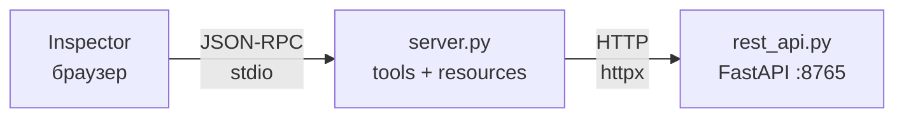

# 05 — Resources

Resources — это **данные, адресуемые по URI**, которые host подшивает в контекст по своим правилам. Если tool — инициатива модели, prompt — инициатива пользователя, то resource — инициатива **host'а**: клиентское приложение само решает, когда и какой ресурс показать или подтянуть в разговор с LLM. Цитата из [спеки 2025-11-25](https://github.com/modelcontextprotocol/modelcontextprotocol/blob/main/docs/specification/2025-11-25/server/resources.mdx):

> Resources in MCP are designed to be **application-driven**, with host applications determining how to incorporate context based on their needs.

Три варианта UX, которые спека называет прямо: tree/list view с явным выбором, поиск с фильтрами, автоматическое включение в контекст по эвристикам или решению модели. Host волен выбрать любой — протокол это не нормирует.

Итого — три оси инициативы для трёх server-примитивов:

| Примитив | Инициатор | Пример UX |
|---|---|---|
| **Tool** | LLM | модель сама решает позвать `search_tasks` посреди ответа |
| **Prompt** | пользователь | пользователь набирает `/review_code` в чате |
| **Resource** | host (приложение) | боковая панель со списком файлов; hover-preview; attach-кнопка |

Чтобы не изобретать новый домен, берём **тот же сервис задач из [`02-rest-wrapper/`](../02-rest-wrapper/)** и выставляем его задачи сразу в двух формах:

- **tools** (из 02) — `list_tasks`, `get_task`, `create_task`, `update_task`, `delete_task`, `search_tasks`. Остаются как были.
- **resources** — те же данные, но по URI: `tasks://all`, `tasks://stats` как **concrete**, `tasks://id/{task_id}` и `tasks://status/{status}` как **templates**.

Один домен двумя путями — это и есть главная мысль главы: выбор «tool или resource» — не про возможности, а **про кто берёт инициативу**.

## Как это выглядит в реальном host'е

Прежде чем лезть в протокол — что с ресурсами делает реальное клиентское приложение. Inspector, через который мы будем работать ниже, — это протокол-дебаггер, а не host; он показывает `List Resources → Read`, и весь UX-слой «host решает, когда подтянуть» оказывается срезан. Чтобы «resource = инициатива host'а» не осталось просто фразой, вот четыре реалистичных сценария для нашего task-домена.

**1. Живой список задач в сайдбаре.** У чата сбоку панель «Мои задачи», подписанная на `tasks://all` через `resources/subscribe` — разберём в [следующей главе `06-notifications/`](../06-notifications/) вместе с остальными server→client уведомлениями. Любое изменение в сервисе — создалась, закрылась, переименовалась — сервер шлёт `notifications/resources/updated`, клиент перечитывает, панель обновляется. **Пользователю не надо рефрешить** и не надо просить модель «позови `list_tasks`, покажи актуальное». Данные живут самостоятельно, и это делает host без участия модели. У каждой строки — кнопка «attach to chat»: клик → `tasks://id/{id}` уходит в следующее сообщение как embedded resource, модель получает контекст, потому что его принёс пользователь.

**2. Авто-инъекция сводки.** PM-ассистент в корп-чате. Перед каждым user-turn host сам дёргает `tasks://stats` и подмешивает в фоновый контекст. Модель всегда знает «3 done / 7 pending» — без tool-call на каждый запрос. Решение «эта сводка всегда релевантна» принял host.

**3. Preload для slash-команды.** Пользователь выбирает `/daily_summary`. Host перед отправкой читает `tasks://status/pending` и `tasks://status/done`, кладёт их в `PromptMessage` как embedded resources и отправляет модели. Ни одного tool-call — host собрал богатый контекст по шаблону.

**4. Hover и mentions.** В чате пишется `#abc-123`. Host парсит, подтягивает `tasks://id/abc-123`, рисует inline-карточку «buy milk — pending». Без адресуемого URI такое не собрать.

Во всех четырёх случаях host читает ресурс **сам**, по своей логике. Модель про эти чтения часто не знает — они происходят до или параллельно её работе. Именно это спека называет «application-driven».

## Что трогаем

Inspector показывает провод; сайдбар — это то, что над ним строит реальный клиент. Вот вызовы, которые под всеми четырьмя сценариями выше лежат, — их и разберём пошагово:

1. **Каталог и чтение** — `resources/list`, `resources/read`.
2. **Templates** — `resources/templates/list` и чтение по подставленному URI (RFC 6570).
3. **Completion** — `completion/complete` с `ref/resource`: автодополнение значений аргументов шаблона.
4. **Resource-блоки в других ответах** — `resource_link` и инлайн `embedded resource` как content-блоки в `tools/call` и в `prompts/get`. Это закрывает сразу два обещания — из [`02-rest-wrapper/`](../02-rest-wrapper/) про content blocks и из [`04-prompts/`](../04-prompts/) про resource-content в `PromptMessage`.

Уведомления (`subscribe`/`updated`, `list_changed`) намеренно вынесены в [следующую главу `06-notifications/`](../06-notifications/) — там весь server→client канал разбирается вместе с progress-уведомлениями как одна концепция.

## Топология

Три процесса — как в [`02-rest-wrapper/`](../02-rest-wrapper/), MCP-сервер просто получает новые декораторы:



`rest_api.py` — копия из 02 без изменений. `server.py` копируем из 02, оставляем все tools, **добавляем** resources и templates сверху.

## Содержимое папки

```
05-resources/
├── pyproject.toml    # mcp, fastapi, uvicorn, httpx — те же, что в 02
├── rest_api.py       # копия из 02: сервис задач
├── server.py         # MCP-сервер: tools из 02 + resources + templates
└── README.md         # этот файл
```

`demo.py` здесь нет: handshake и lifecycle уже разобраны в 01, а для completion и ресурсов Inspector удобнее. Там, где нужен сырой wire (ошибки), используем ручной `echo | uv run python server.py` — как в [`03-errors/`](../03-errors/).

## Установка и запуск

```bash
uv sync
```

Два терминала — как в 02:

```bash
# терминал 1 — REST-downstream
uv run python rest_api.py

# терминал 2 — MCP-сервер под Inspector
npx @modelcontextprotocol/inspector uv run python server.py
```

В Inspector → **Connect** → дальше работаем по шагам ниже.

## server.py

Берём код из [`02-rest-wrapper/`](../02-rest-wrapper/) как базу — все 6 tools остаются без единой правки, дублировать их здесь не будем. Сверху добавляем четыре ресурса: два concrete и два templates.

**Concrete — готовый URI, одна запись в каталоге:**

```python
@mcp.resource(
    "tasks://all",
    title="Все задачи",
    description="Снимок всего списка задач одним JSON-массивом.",
    mime_type="application/json",
)
def all_tasks_resource() -> list[dict]:
    """Current snapshot of every task as a JSON array."""
    r = http.get("/tasks")
    r.raise_for_status()
    return r.json()
```

**Template — URI с плейсхолдером, одна запись описывает бесконечное семейство:**

```python
@mcp.resource(
    "tasks://id/{task_id}",
    title="Задача по id",
    description="Одна задача по её идентификатору.",
    mime_type="application/json",
)
def task_by_id_resource(task_id: str) -> dict:
    r = http.get(f"/tasks/{task_id}")
    r.raise_for_status()
    return r.json()
```

Два других — `tasks://stats` (concrete, текстовая сводка) и `tasks://status/{status}` (template, фильтрация по статусу) — по той же схеме, смотри полный [`server.py`](server.py).

Три вещи, на которые стоит обратить внимание прямо сейчас — остальное увидим в wire-разборах ниже:

- **Ключ — URI, а не имя функции.**. Tool зовут по имени (`tools/call` с `name: "search_tasks"`), resource читают по адресу (`resources/read` с `uri: "tasks://all"`).

- **Concrete vs template — FastMCP смотрит, есть ли `{}` в URI.** Без скобок — concrete: клиент шлёт `tasks://all`, зовётся `all_tasks_resource()` без аргументов. Со скобками — template: клиент шлёт `tasks://id/abc-123`, FastMCP матчит на `tasks://id/{task_id}` и вызывает `task_by_id_resource(task_id="abc-123")`. Имена плейсхолдеров и аргументов функции должны совпадать.

- **`mime_type`.** Ресурс — одна единица данных с одним MIME-типом; клиент по нему решает, как отрисовать. Отсюда `text/plain` для `tasks://stats` (читать глазами) и `application/json` для остальных (структурированные данные).

## Шаг 1 — каталог (`resources/list`)

В Inspector после **Connect** переходи на таб **Resources** → **List Resources**. В левой панели появятся две строки — `all_tasks_resource` и `tasks_stats_resource`.

**Templates здесь не видно** — ни `tasks://id/{task_id}`, ни `tasks://status/{status}`. Для шаблонов — отдельный метод `resources/templates/list` и отдельная вкладка Inspector, доберёмся до них в [шаге 3](#шаг-3--templates-resourcestemplateslist).

### Wire

Запрос короче некуда:

```json
>>> {"jsonrpc":"2.0","method":"resources/list","id":2}
```

`params` опущены. Единственное, что сюда можно положить — `cursor` для пагинации (общая механика для всех `*/list`-методов); FastMCP 1.27.0 cursor всё равно игнорирует и отдаёт список одним куском.

Ответ (отформатирован, в реале — одна строка):

```json
<<< {
  "jsonrpc": "2.0",
  "id": 2,
  "result": {
    "resources": [
      {
        "name": "all_tasks_resource",
        "title": "Все задачи",
        "uri": "tasks://all",
        "description": "Снимок всего списка задач одним JSON-массивом.",
        "mimeType": "application/json"
      },
      {
        "name": "tasks_stats_resource",
        "title": "Статистика по задачам",
        "uri": "tasks://stats",
        "description": "Сводка: всего / выполнено / осталось. Текстовый plain-блок.",
        "mimeType": "text/plain"
      }
    ]
  }
}
```

<details>
<summary><b>Разбор ответа</b> — поля записи, опциональные поля спеки, чего у resources нет в принципе</summary>

**Что в каждой записи:**

- **`uri`** — **первичный ключ** ресурса; именно его клиент положит следом в `resources/read`. Схема любая, лишь бы по RFC 3986 — наша `tasks://` легальна.
- **`name`** — машинное имя, **обязательное** по спеке. FastMCP берёт его из имени Python-функции, отсюда уродливое `all_tasks_resource` в wire. В боевом сервере лучше задавать явно: `@mcp.resource("tasks://all", name="all-tasks", ...)`. Клиент покажет `name`, если `title` не задан.
- **`title`** — человекочитаемая метка. Именно её рисуют Claude Desktop, Cursor, VS Code в UI. Кириллица уезжает в JSON без эскейпа.
- **`description`** — свободный текст про назначение. Играет ту же роль, что docstring у tool: помогает host'у (и в некоторых клиентах — модели) понять, что за данные.
- **`mimeType`** — напрямую из `mime_type=` в декораторе. На него ориентируется клиент, решая, как рендерить контент: `text/plain` — показать как есть, `application/json` — парсить и подсветить.

**Опциональные поля спеки, которых в нашем ответе нет** (в декораторе не задали — FastMCP и не прислал):

- **`annotations`** — `audience` (`"user"` / `"assistant"`), `priority` (0.0–1.0), `lastModified` (ISO 8601). **Важно:** это **не те** аннотации, что `ToolAnnotations` из 02. Имя общее, набор полей разный. Здесь аннотации отвечают на «кому ресурс полезен, насколько он важен, когда обновлялся», а не на «безопасно ли звать дважды».
- **`size`** — размер контента в байтах, если сервер его знает. Host по нему прикидывает расход контекста **до** того, как звать `resources/read`.
- **`icons`** — опциональные пиктограммы для UI (SEP-973, пришло с ревизией 2025-11-25).

**Чего у resources нет в принципе** (ни у нас, ни в спеке):

- Никаких `inputSchema` / `outputSchema`. Входом служит сам URI, формой выхода — `mimeType`.
- Никакого `isError` или domain-канала ошибок. Всё, что может сломаться при чтении, вернётся как JSON-RPC error на `resources/read` — спека обещает специальный код `-32002 Resource not found` для неизвестных URI. FastMCP 1.27.0, к слову, его не использует — возвращает `code: 0` с текстом в `message`; ещё одна параллель к [03-errors/](../03-errors/) по части расхождения SDK со спекой.

</details>

## Шаг 2 — чтение concrete resource (`resources/read`)

Кликни по `all_tasks_resource`: Inspector сразу отправляет `resources/read` и кладёт пару request/response в панель **History** справа.

### Wire

```json
>>> {"jsonrpc":"2.0","method":"resources/read","params":{"uri":"tasks://all"},"id":3}
```

Ответ (`text` — одна длинная строка, разбито для читаемости):

```json
<<< {
  "jsonrpc": "2.0",
  "id": 3,
  "result": {
    "contents": [
      {
        "uri": "tasks://all",
        "mimeType": "application/json",
        "text": "[\n  {\n    \"id\": \"aca37ad5-1347-4cdf-af52-db7fe022f3ff\",\n    \"title\": \"buy milk\",\n    \"done\": false,\n    \"created_at\": \"2026-04-21T04:14:15+00:00\"\n  },\n  ...\n]"
      }
    ]
  }
}
```

<details>
<summary><b>Разбор ответа</b> — структура <code>contents</code>, text vs blob, конверт vs <code>tools/call</code></summary>

- **`contents` — массив, даже при одном ресурсе.** Задел на случай, когда URI раскрывается в несколько под-ресурсов (директория `file:///project/`, композитный документ). Для `tasks://*` элемент всегда один.
- **`contents[i]`** — либо `TextResourceContents` (`{uri, mimeType, text}`), либо `BlobResourceContents` (`{uri, mimeType, blob}` в base64). В FastMCP правило простое: `str` или JSON-сериализуемое → `text`; `bytes` → `blob`. Наш `list[dict]` стал `text` с JSON через `pydantic_core.to_json(indent=2)`.
- **`uri` в ответе** совпадает с запрошенным (или является его суб-URI). Клиент держит по нему кэш и сопоставляет ответы.
- **Нет `structuredContent`, нет `isError`.** Конверт проще, чем у `tools/call`: роль `structuredContent` играет `text` вместе с `mimeType: application/json` (контракт формы), роль `isError` — JSON-RPC error с `-32002 Resource not found` (спецификационный код для ресурсов) или `-32603` на internal — вместо `result`.

</details>

## Шаг 3 — templates (`resources/templates/list`)

В том же табе **Resources** под кнопкой **List Resources** есть вторая — **List Templates**. Жми её: слева появятся два шаблона — `task_by_id_resource` и `tasks_by_status_resource`.

### Wire

```json
>>> {"jsonrpc":"2.0","method":"resources/templates/list","id":4}
```

```json
<<< {
  "jsonrpc": "2.0",
  "id": 4,
  "result": {
    "resourceTemplates": [
      {
        "name": "task_by_id_resource",
        "title": "Задача по id",
        "uriTemplate": "tasks://id/{task_id}",
        "description": "Одна задача по её идентификатору.",
        "mimeType": "application/json"
      },
      {
        "name": "tasks_by_status_resource",
        "title": "Задачи по статусу",
        "uriTemplate": "tasks://status/{status}",
        "description": "Задачи, отфильтрованные по статусу: 'done' или 'pending'.",
        "mimeType": "application/json"
      }
    ]
  }
}
```

<details>
<summary><b>Разбор ответа</b> — <code>uriTemplate</code>, зачем отдельный метод, RFC 6570</summary>

- **`resourceTemplates` вместо `resources`.** Другой ключ — намеренно: клиент по нему сразу понимает, что элементы **не готовы к чтению**. Нельзя взять `uriTemplate` и подставить в `resources/read` — сервер не матчит URI с `{}` буквально.
- **`uriTemplate` вместо `uri`** — [RFC 6570](https://www.rfc-editor.org/rfc/rfc6570) Level 1+: плейсхолдеры в `{}`. Заполнить их — ответственность клиента; сервер описывает лишь форму. Поэтому шаблоны нельзя перечислить как concrete: `tasks://id/{task_id}` покрывает бесконечное семейство URI, `resources/list` их никогда не вернул бы.
- **Остальные поля те же**, что у concrete в [шаге 1](#шаг-1--каталог-resourceslist): `name`, `title`, `description`, `mimeType`, опциональные `annotations` / `icons`. Разбор — там же.

</details>

## Шаг 4 — чтение по templated URI

Клик по `task_by_id_resource` в списке шаблонов раскрывает карточку с полем `task_id` и кнопкой **Read Resource**. Подставь любой id из того, что вернул `tasks://all` (у нас — `aca37ad5-1347-4cdf-af52-db7fe022f3ff`) и жми кнопку.

### Wire

Подстановкой занимается **клиент** — под капотом уходит уже готовый URI, сервер про шаблон узнаёт только по факту матча:

```json
>>> {"jsonrpc":"2.0","method":"resources/read","params":{"uri":"tasks://id/aca37ad5-1347-4cdf-af52-db7fe022f3ff"},"id":5}
```

```json
<<< {
  "jsonrpc": "2.0",
  "id": 5,
  "result": {
    "contents": [
      {
        "uri": "tasks://id/aca37ad5-1347-4cdf-af52-db7fe022f3ff",
        "mimeType": "application/json",
        "text": "{\n  \"id\": \"aca37ad5-1347-4cdf-af52-db7fe022f3ff\",\n  \"title\": \"buy milk\",\n  \"done\": false,\n  \"created_at\": \"2026-04-21T04:14:15+00:00\"\n}"
      }
    ]
  }
}
```

<details>
<summary><b>Разбор</b> — матчинг URI, почему подставляет клиент, отличия от concrete-чтения</summary>

- **Метод тот же — `resources/read`.** Отдельного `resources/read_template` нет: для клиента разница только в том, что URI он собирал сам.
- **Матчинг на стороне FastMCP.** `{task_id}` в `uriTemplate` компилируется в регулярку `(?P<task_id>[^/]+)`; входящий URI прогоняется по всем шаблонам, первый матч выигрывает, captured groups становятся kwargs для функции — `task_by_id_resource(task_id="aca37ad5-...")`. **Имя плейсхолдера обязано совпадать с именем аргумента**, иначе FastMCP падает ещё на регистрации.
- **`uri` в ответе — конкретный**, не шаблонный (`tasks://id/aca37ad5-...`, не `tasks://id/{task_id}`). Клиент кэширует и сопоставляет ответы по этому значению.
- **Конверт идентичен concrete-чтению** из [шага 2](#шаг-2--чтение-concrete-resource-resourcesread): `contents[]`, `text`/`blob`, `mimeType`. Всё, что сказано там, применимо здесь.
- **Ошибки.** Не матчнулся ни один шаблон или плохой формат URI — JSON-RPC error. По спеке — `-32002 Resource not found`; FastMCP 1.27.0 использует невалидный `code: 0` с текстом в `message`.

</details>

## Шаг 5 — completion для template-аргументов

У template-ресурсов аргументы текстовые и свободные: `tasks://status/{status}` принимает `"done"`, `"pending"` или мусор. Чтобы клиент не гадал, MCP отдельной capability `completions` даёт сервер-сайд автодополнение: клиент по мере ввода шлёт `completion/complete`, сервер возвращает подходящие значения.

### Чем это обеспечивается в server.py

Один хендлер на весь сервер — сам различает, откуда пришёл запрос, по `ref`:

```python
@mcp.completion()
async def complete(
    ref: PromptReference | ResourceTemplateReference,
    argument: CompletionArgument,
    context: CompletionContext | None,
) -> Completion | None:
    if not isinstance(ref, ResourceTemplateReference):
        return None

    if ref.uri == "tasks://status/{status}" and argument.name == "status":
        values = [s for s in ("done", "pending") if s.startswith(argument.value)]
        return Completion(values=values, total=len(values), hasMore=False)

    if ref.uri == "tasks://id/{task_id}" and argument.name == "task_id":
        r = http.get("/tasks")
        r.raise_for_status()
        ids = [t["id"] for t in r.json() if t["id"].startswith(argument.value)]
        return Completion(values=ids, total=len(ids), hasMore=False)

    return None
```

Полный файл — в [`server.py`](server.py). В Inspector: на карточке шаблона под полем параметра появится выпадающий список подсказок — Inspector дёргает `completion/complete` при каждом изменении.

### Wire

Пользователь ввёл `"p"` в поле `status`:

```json
>>> {"jsonrpc":"2.0","method":"completion/complete","params":{"ref":{"type":"ref/resource","uri":"tasks://status/{status}"},"argument":{"name":"status","value":"p"}},"id":7}
```

```json
<<< {"jsonrpc":"2.0","id":7,"result":{"completion":{"values":["pending"],"total":1,"hasMore":false}}}
```

То же самое по шаблону id c префиксом `"ac"`:

```json
>>> {"jsonrpc":"2.0","method":"completion/complete","params":{"ref":{"type":"ref/resource","uri":"tasks://id/{task_id}"},"argument":{"name":"task_id","value":"ac"}},"id":8}
```

```json
<<< {"jsonrpc":"2.0","id":8,"result":{"completion":{"values":["aca37ad5-1347-4cdf-af52-db7fe022f3ff"],"total":1,"hasMore":false}}}
```

<details>
<summary><b>Разбор</b> — capability, типы <code>ref</code>, лимиты, <code>context</code></summary>

- **Capability объявляется сама.** При регистрации `@mcp.completion()` FastMCP добавляет в `initialize` response `"completions": {}` (пустой объект, не bool — флагов внутри пока нет). Клиенты, у которых capability не пришла, `completion/complete` не шлют вовсе — так экономят round-trip. Тут SDK ведёт себя корректно: capability зависит от факта регистрации хендлера (в отличие от `subscribe`-capability, которая в 1.27.0 захардкожена в `false` — разберём в [06-notifications/](../06-notifications/)).
- **Два типа `ref`.** `ref/resource` (как у нас) — `{type, uri}`, где `uri` — **шаблонный** URI, ровно такой, как в `resources/templates/list`. `ref/prompt` — `{type, name}` для аргументов prompts (обсудим в контексте [04](../04-prompts/README.md), если понадобится). Один и тот же хендлер обслуживает оба; различай через `isinstance(ref, ...)`, нерелевантные ветки возвращают `None`.
- **`argument.value` — уже введённый префикс.** Клиент шлёт запрос на каждый нажатый символ, сервер фильтрует из своего источника данных. В примере с `task_id` мы ходим в REST — completion может стоить как обычный чтение-запрос, это нормально.
- **Формат ответа.** `Completion.values` — массив строк, **≤ 100** по спеке. `total` — сколько их вообще (может быть больше, чем в `values`, если режем). `hasMore: true` — сигнал клиенту «есть ещё, сузь префикс». Обе метаданные опциональны.
- **`context` — цепочки автодополнений.** Если одно значение зависит от другого (например, `{repo}/{branch}` — сначала выбери репу, потом предлагай её ветки), клиент в `context.arguments` передаст уже выбранные. У нас аргументы независимые — поле не используем.
- **Возврат `None`.** Легальный ответ «не знаю» — FastMCP конвертит его в `completion/complete` → `{values: [], total: 0, hasMore: false}`. Полезно как fallback, если `ref` не подошёл ни под одну ветку.

</details>

## Resource-блоки в других ответах

Ресурс может оказаться не только в `resources/read`, но и внутри `content[]` от `tools/call` или `PromptMessage` от `prompts/get` — наравне с text-блоками. Два варианта:

- **`resource_link`** — только URI, тела нет. Клиент сам решит, читать ли через `resources/read`.
- **`embedded resource`** — тело ресурса инлайн в блоке. Читать отдельно не нужно.

Разберём оба на живых примерах.

### В `tools/call` — text + resource_link

Новый tool возвращает **список из двух блоков** вместо сериализованного `Task` — подтверждение и ссылку на созданную задачу:

```python
@mcp.tool(title="Create task (with link)", ...)
def create_task_linked(title: str):
    r = http.post("/tasks", json={"title": title})
    task = r.json()
    return [
        TextContent(type="text", text=f"created: {task['title']}"),
        ResourceLink(
            type="resource_link",
            uri=AnyUrl(f"tasks://id/{task['id']}"),
            name=f"task-{task['id'][:8]}",
            title=task["title"],
            mimeType="application/json",
        ),
    ]
```

Без return-аннотации специально: иначе FastMCP построит `output_schema` и продублирует блоки в `structuredContent`.

**Wire:**

```json
>>> {"jsonrpc":"2.0","method":"tools/call","params":{"name":"create_task_linked","arguments":{"title":"learn resource_link"}},"id":10}
```

```json
<<< {"jsonrpc":"2.0","id":10,"result":{"content":[
  {"type":"text","text":"created: learn resource_link"},
  {"type":"resource_link","uri":"tasks://id/cef7accc-3006-4bb0-a9c9-8d4d68d79922","name":"task-cef7accc","title":"learn resource_link","mimeType":"application/json"}
],"isError":false}}
```

<details>
<summary><b>Разбор</b> — что такое <code>resource_link</code> и что с ним делает клиент</summary>

- Поля — те же, что у записи в `resources/list` ([шаг 1](#шаг-1--каталог-resourceslist)), плюс дискриминатор `type: "resource_link"`.
- URI **не обязан** быть в `resources/list` — спека разрешает tool'ам ссылаться на ресурсы, которых в каталоге нет.
- Семантика — UX-подсказка: клиент решает, открыть ли пользователю «view»-кнопку, прочитать ли автоматом и прикрепить к контексту, или проигнорировать.

</details>

### В `prompts/get` — embedded resource

Новый prompt собирает из двух user-сообщений: инструкция + инлайн JSON задачи:

```python
@mcp.prompt(title="Show task inline")
def show_task(task_id: str) -> list[prompts_base.Message]:
    r = http.get(f"/tasks/{task_id}")
    return [
        prompts_base.UserMessage("Объясни эту задачу, опираясь на её данные:"),
        prompts_base.UserMessage(
            content=EmbeddedResource(
                type="resource",
                resource=TextResourceContents(
                    uri=AnyUrl(f"tasks://id/{task_id}"),
                    mimeType="application/json",
                    text=r.text,
                ),
            )
        ),
    ]
```

**Wire:**

```json
>>> {"jsonrpc":"2.0","method":"prompts/get","params":{"name":"show_task","arguments":{"task_id":"aca37ad5-1347-4cdf-af52-db7fe022f3ff"}},"id":11}
```

```json
<<< {"jsonrpc":"2.0","id":11,"result":{"messages":[
  {"role":"user","content":{"type":"text","text":"Объясни эту задачу, опираясь на её данные:"}},
  {"role":"user","content":{"type":"resource","resource":{
    "uri":"tasks://id/aca37ad5-1347-4cdf-af52-db7fe022f3ff",
    "mimeType":"application/json",
    "text":"{\"id\":\"aca37ad5-...\",\"title\":\"buy milk\",\"done\":false,...}"
  }}}
]}}
```

<details>
<summary><b>Разбор</b> — форма <code>embedded resource</code>, почему два сообщения</summary>

- `type: "resource"` → поле `resource` внутри, формата `TextResourceContents` или `BlobResourceContents` — та же форма, что в `contents[]` из [шага 2](#шаг-2--чтение-concrete-resource-resourcesread).
- `PromptMessage.content` — **один** блок, не массив. Поэтому «текст + задача» = два сообщения. Склеить в один text-блок можно, но клиент потеряет границу между инструкцией и данными и не сможет отрисовать ресурс отдельной карточкой.

</details>

**Когда что:** ссылка — если данные большие или могут не пригодиться; embedded — если маленькие и нужны LLM гарантированно.

### Пример архитектуры: RAG над корпоративной базой знаний

Классический кейс, где разделение «что в tool, что в resources» играет особенно чисто — оно ложится ровно на три оси инициативы из начала главы:

- **Tool `retrieve(query)` → `content[]` с top-N чанками как text-блоки.** Это то, что **LLM** ест прямо в контекст: retrieval инициировала модель, модель же и потребляет. Второго round-trip нет, чанки сразу в истории. Опционально к каждому чанку прикладываем `resource_link` на исходный документ — чтобы модель могла сослаться `[1]`, `[2]`.
- **Resources-каталог → полные документы как URI.** Это то, что видит **UI/пользователь**: сайдбар с деревом `docs://kb/*`, кнопка attach, hover-preview, поиск по названиям. Host-инициатива.
- **Связь между уровнями — URI.** Чанк из tool ссылается на `docs://kb/refund-policy`; этот же URI фигурирует в resources-каталоге. Клиент дедуплицирует, UI делает сноски `[1]` кликабельными в ту же карточку, что видна в сайдбаре.

| Уровень | Инициатор | Что несёт | Примитив |
|---|---|---|---|
| Retrieval (семантика, динамика) | LLM | top-N чанков как text + `resource_link` на источник | **tool** |
| Browse / attach / pin (курируемое) | пользователь через UI | полные документы, иерархия, метаданные | **resources** |

Сценарий UX: пользователь пишет «разберись с политикой возврата». Модель вызывает `retrieve` — получает 10 чанков, отвечает, цитирует `[1]`, `[2]`. Пользователь кликает `[1]` в UI — host открывает полный документ из `docs://kb/refund-policy` в сайдбаре. Параллельно пользователь может сам до вопроса приаттачить 2-3 документа из сайдбара — они уйдут в контекст как **embedded resource** по инициативе host'а, а не модели.

Выигрыш от такого разделения:

- **LLM платит токенами только за чанки, которые реально помогли.** Полные документы не зашиваются в контекст автоматом.
- **Пользователь получает навигируемый каталог**, не зависящий от того, что модель сочла релевантным — можно принести свою интуицию, пролистать вручную.
- **Permissions/ACL/аудит централизованы на `resources/read`** — один канал выдачи содержимого, неважно, дёрнула его модель через tool или пользователь открыл в UI.

Главная мысль: **tool — «сделать», resource — «дать подержать».** RAG расщепляется по этим осям естественно; всё-в-одном-tool работает, но теряет половину выразительности.

**Цена дублирования.** Ничего не запрещает выставить одну и ту же сущность и как tool, и как resource — у нас в главе это, собственно, и сделано с задачами. Но за это платишь:

- **Два кода, две схемы, два канала ошибок.** Любое изменение в модели данных — править в двух местах.
- **Два места под ACL/аудит.** Права на `tasks/list` (tool) и `tasks://all` (resource) проверяются в разных хендлерах — легко разъехаться.
- **UX-путаница у пользователя.** Если host показывает и tool-кнопки, и resource-сайдбар с одними и теми же задачами, пользователь видит одно и то же дважды и не понимает, чем пользоваться.
- **Риск путаницы модели — только если host сам решил показать resources LLM.** По умолчанию LLM видит tools, resources остаются внутри host'а. Но если host подшивает URI в system-prompt или авто-аттачит по эвристике — тогда модель может дёрнуть `list_tasks` вместо чтения `tasks://all`, и это уже ответственность host'а, а не сервера.

По умолчанию выбирай один путь. Два — только если у tool и resource реально разные consumer'ы (LLM vs host-UI), как в RAG-примере выше.

## Tools / prompts / resources — сводная

Таблица расширяет ту, что была в [04-prompts/](../04-prompts/README.md) — теперь все три server-примитива вместе:

| | Tools | Prompts | Resources |
|---|---|---|---|
| Инициатор | LLM | пользователь | host/приложение |
| Идентификатор | `name` | `name` | `uri` |
| List-метод | `tools/list` | `prompts/list` | `resources/list` + `resources/templates/list` |
| Parametrized lookup | — | — | RFC 6570 URI templates |
| «Получить» | `tools/call` | `prompts/get` | `resources/read` |
| Ответ | `content[]` + `structuredContent` + `isError` | `messages[]` | `contents[]` |
| Content-блоки `resource_link` / `embedded` в ответе | ✓ | ✓ | — (сам ресурс и есть контент) |
| Domain-level ошибки | `isError: true` | — (через protocol error) | — (только JSON-RPC error, в т.ч. `-32002`) |
| Completion (`completion/complete`) | — | `ref/prompt` для аргументов | `ref/resource` для template-аргументов |
| Пагинация в list | ✓ | ✓ | ✓ (по `cursor`/`nextCursor`) |
| `listChanged`-уведомление | ✓ | ✓ | ✓ |
| `subscribe`/`updated`-уведомление | — | — | ✓ (только у ресурсов) |

Уведомления намеренно вынесены в [следующую главу](../06-notifications/) — там они разбираются отдельно; здесь только факт наличия.

## Что потрогать

1. **Bytes вместо str.** Перепиши `all_tasks_resource()` так, чтобы возвращать `bytes` (например, `json.dumps(...).encode()`). В wire появится `blob: "<base64>"` вместо `text`. Посмотри, что с `mimeType` — FastMCP оставит тот, что в декораторе, не пытаясь угадать.
2. **Json-stats.** Перепиши `tasks_stats_resource()` чтобы вернуть `dict` вместо строки, а в декораторе поменяй `mime_type` на `application/json`. FastMCP сериализует сам, клиенты начнут получать структурированные данные — но «лежа́-на-глаз» читать станет хуже.
3. **Default в template.** Сделай template `tasks://status/{status}` с default-значением (например, `status: str = "pending"`). FastMCP в 1.27.0 не понимает default'ов в URI-шаблоне — проверь, что именно произойдёт: ошибка регистрации, template с обязательным параметром или что-то ещё.
4. **Mixed content из `create_task`.** Сделай так, чтобы **оригинальный** `create_task` (не `create_task_linked`) возвращал text + resource_link одним списком. Придётся убрать return-аннотацию `-> Task` — посмотри, что в ответе пропадёт `structuredContent`, и подумай, нормально ли это в твоём сценарии.
5. **Completion для prompt-аргументов.** В хендлере `complete()` ветка для `PromptReference` сейчас возвращает `None`. Добавь обработку: для `show_task` подсказывай `task_id` тем же списком, что и для ресурса. Протестируй, что Inspector показывает подсказки в форме prompt'а.

## Что разобрали

- **Resources — данные по URI, инициатива у host'а.** Третья ось в треугольнике tool/prompt/resource: tool зовёт LLM, prompt — пользователь, resource — приложение.
- **Ментальная модель через UX.** Живой сайдбар, авто-инъекция сводки, preload для slash-команды, hover-карточки — всё это host-канал, в котором resources естественны, а tool был бы натянут.
- **Concrete vs template.** Concrete — готовый URI, одна запись в каталоге. Template — RFC 6570 URI с плейсхолдерами, одна запись покрывает бесконечное семейство; подставляет параметры **клиент**, сервер матчит на регулярке и зовёт функцию с kwargs.
- **Completion.** Отдельная capability `completions`, один хендлер обслуживает `ref/resource` и `ref/prompt`. У FastMCP этот кусок ведёт себя корректно — capability объявляется по факту регистрации.
- **Resource-блоки в других ответах.** `resource_link` (ссылка, без тела) и `embedded resource` (тело инлайн) — два способа протащить ресурс в `tools/call.content[]` или `prompts/get.messages[i].content`. `content[]` в tool'ах — не монотип; mix text + link + embedded разрешён.
- **RAG как двухуровневая архитектура.** Tool `retrieve` — top-N чанков для LLM; resources-каталог — полные документы для UI. Инициатор + тип пейлоада + кто читает разведены по двум примитивам.
- **У ресурсов свой код ошибки.** Спека требует `-32002 Resource not found` — единственный domain-специфичный код среди трёх примитивов. FastMCP 1.27.0 его игнорирует и возвращает невалидный `code: 0`; параллель к [03-errors/](../03-errors/) про расхождение SDK и спеки.

Дальше — [`06-notifications/`](../06-notifications/): server→client канал целиком. Кейс «живого сайдбара» из mental-model-секции там разворачивается в `resources/subscribe` + `notifications/resources/updated`; разбираем `list_changed` для всех трёх примитивов, progress-уведомления для долгих операций, и бонусом — FastMCP-баг с захардкоженным `subscribe: false` как симметрия к 03.
