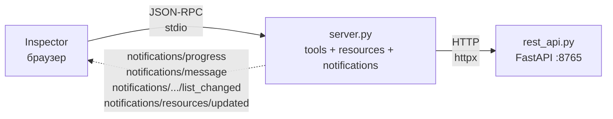

# 06 — Notifications

Первая глава, где **сервер сам пишет в клиент**, вне контекста чьего-то request'а. До этого всё жило так: клиент спросил — сервер ответил (а в [03-errors/](../03-errors/) мы видели, что и JSON-RPC error возвращается на тот же request). Теперь сервер инициирует сообщения сам, по своей логике, и они прилетают **асинхронно** — в любой момент между обычными response'ами.

> - **Мы по-прежнему на stdio.** На stdio server→client канал бесплатен: у клиента и сервера общий stdout-стрим, сервер пишет туда notifications в любой момент, всё мультиплексируется на одном pipe. 
> - На **Streamable HTTP** (глава [`10-http/`](../10-http/)) за ту же фичу платишь отдельным долгоживущим соединением 
>   - request-bound нотификации (progress) летят как SSE поверх ответа на POST
>   - session-bound (logging, list_changed, updated) — требуют от клиента параллельно держать standalone `GET /mcp` с SSE.

Канал один (JSON-RPC notification без `id`), но семантически он закрывает четыре разных задачи. Разбираем все в одной главе, чтобы не расщеплять понимание «server→client async».

| Тип | Что говорит | Привязка | Capability |
|---|---|---|---|
| `notifications/progress` | «по твоему долгому request'у — вот состояние» | к request'у через `_meta.progressToken` | — (opt-in со стороны клиента через `progressToken`) |
| `notifications/message` | «залогируй: level=X, data=Y» | к сессии | `logging: {}` |
| `notifications/<kind>/list_changed` | «каталог tools/prompts/resources поменялся — перечитай» | к примитиву | `<kind>.listChanged: true` |
| `notifications/resources/updated` | «URI X обновился — перечитай, если подписан» | к конкретному URI | `resources.subscribe: true` |

### Capability — это контракт, объявленный один раз в `initialize`

Понятие мы уже видели в [01-hello](../01-hello/README.md#шаг-1--initialize) и [§3 главного README](../../README.md#capability-negotiation). Напоминаю суть: в ответе на `initialize` сервер объявляет флаги того, что он **умеет и будет использовать**:

```json
"capabilities": {
  "logging":   {},                                // будет слать notifications/message
  "tools":     { "listChanged": true },           // будет слать tools/list_changed
  "prompts":   { "listChanged": true },           // будет слать prompts/list_changed
  "resources": { "subscribe": true,               // примет resources/subscribe + будет слать updated
                 "listChanged": true }            // будет слать resources/list_changed
}
```

Правило спеки ([lifecycle.mdx](https://github.com/modelcontextprotocol/modelcontextprotocol/blob/main/docs/specification/2025-11-25/basic/lifecycle.mdx)): **клиент MUST использовать только те capability, о которых сервер заявил**. Это не enforcement на уровне транспорта — сервер технически может послать любую нотификацию, клиент технически её увидит. Но строгий клиент **игнорирует** нотификации и не шлёт сопутствующих requests (`logging/setLevel`, `resources/subscribe`), если соответствующего флага не было.

Теперь построчно по таблице:

- **`progress`** — единственный тип без capability-декларации. Спека это намеренно: progress включается «на лету» клиентом через `_meta.progressToken` в любом его запросе. Не нужно заранее договариваться на handshake'е — хочешь progress по этому вызову, кидай токен; не хочешь — не кидай.

- **`notifications/message` (logging)** — сервер объявляет `logging: {}` (пустой объект, флагов внутри нет). Без этого флага клиент не отправит `logging/setLevel` и не ожидает `notifications/message`. FastMCP 1.27.0 этот флаг **не ставит** — значит строгий клиент наше `ctx.info(...)` проигнорирует. Смотрим живьём в шаге 2.

- **`list_changed`** — три отдельных булева флага внутри `tools`/`prompts`/`resources`. Каждый значит «я пошлю `notifications/<kind>/list_changed`, когда мой каталог реально поменяется». Клиент, увидев `listChanged: true`, знает: можно не полинговать `*/list`, подписаться на notification и перечитывать по факту. В FastMCP 1.27.0 эти три флага всегда `false` — последствия разбираем в шаге 3.

- **`resources.subscribe`** — флаг, что сервер принимает `resources/subscribe` requests на конкретный URI и будет слать `updated` подписчикам. Это единственный случай, когда capability объявляет **дополнительный request-метод** (`resources/subscribe`/`unsubscribe`), а не только notification. В FastMCP 1.27.0 флаг захардкожен `false`, плюс handler'ы не зарегистрированы — масштаб этого пропуска разбираем в шаге 4.

Одна механика — четыре разные задачи. Разбираем их по возрастанию спек-расхождения в FastMCP 1.27.0: **progress** — из коробки, как спека и требует; **logging** — wire работает, но capability не объявлена; **list_changed** — все три флага `false`; **subscribe** — capability `false`, handler'ы отсутствуют. Рамка на все четыре — «спека vs факт»: показываем, что по контракту, и что по проводу, ничего не правим. Тот же подход, что в [03-errors/](../03-errors/), только уже не про ошибки, а про capability negotiation.

## Топология

Та же, что в 05. MCP-сервер получает новые хендлеры, downstream и клиентский transport — без изменений:



Пунктирная стрелка — сами уведомления: отдельно подсвечены как тот самый server→client канал, которого в 05 не было.

## Содержимое папки

```
06-notifications/
├── pyproject.toml    # mcp, fastapi, uvicorn, httpx — те же, что в 05
├── rest_api.py       # копия из 05: сервис задач
├── server.py         # базируется на 05; шаги 1–4 добавляются сюда блоками
└── README.md         # этот файл
```

`demo.py` здесь нет. Inspector в 06 как раз хорош: **Server Notifications** панель показывает сырой JSON каждой прилетевшей `notifications/*` по мере поступления; для progress рисует прогресс-бар нативно, для logging — отдельный Logs-таб, для subscribe — Subscriptions-таб. Повторно доказывать envelope (`jsonrpc`, `id`) после 01 нет смысла — читатель уже умеет.

## Установка и запуск

```bash
uv sync
```

Два терминала — как в 02/05:

```bash
# терминал 1 — REST-downstream
uv run python rest_api.py

# терминал 2 — MCP-сервер под Inspector
npx @modelcontextprotocol/inspector uv run python server.py
```

В Inspector → **Connect** → работаем по шагам ниже.

---

## Шаг 1 — `progress`

Полезно там, где tool внутри делает много мелких шагов за ощутимое время: bulk-операция над N записями, прогон миграции/реиндекса, или вызов downstream-сервиса, который сам возвращает прогресс (CI-билд, git-clone, долгий export). Без сигнала «N из M сделано» UI замирает на спиннере — и через 5 секунд пользователь решает, что всё зависло.

Это самое тонкое из четырёх семейств и одновременно самое простое в реализации: FastMCP всё автоматизирует, capability не нужна, никаких обходов.

### Что такое progress-token

Механика отличается от остальных трёх: это **opt-in со стороны клиента**. Если клиент хочет получать progress-уведомления по долгому вызову, он **в самом запросе** кладёт `_meta.progressToken`:

```json
{
  "jsonrpc": "2.0", "id": 42, "method": "tools/call",
  "params": {
    "name": "slow_bulk_import",
    "arguments": { "count": 3 },
    "_meta": { "progressToken": "demo-42" }
  }
}
```

Сервер, занимаясь работой, шлёт ноль или больше:

```json
{
  "jsonrpc": "2.0", "method": "notifications/progress",
  "params": { "progressToken": "demo-42", "progress": 1, "total": 3, "message": "..." }
}
```

и в конце — обычный response на `id: 42`. Если клиент токен **не** прислал, сервер ничего не шлёт — молча работает.

<details>
<summary><b>Правила спеки</b> — токен, монотонность, rate-limiting</summary>

Из [progress.mdx](https://github.com/modelcontextprotocol/modelcontextprotocol/blob/main/docs/specification/2025-11-25/basic/utilities/progress.mdx):

- Токен — string или integer, выбирает клиент, **MUST** быть уникален среди активных requests.
- `progress` **MUST** increase с каждой нотификацией. `total` может отсутствовать (неизвестно). `message` — свободная строка, SHOULD быть human-readable.
- После финального response больше нотификаций по этому токену быть не должно.
- Rate-limiting — на обеих сторонах, чтобы не затопить канал.

</details>

### Tool

Добавляем в `server.py` долгий tool, который имитирует серию шагов:

```python
@mcp.tool(
    title="Bulk import tasks (slow)",
    annotations=ToolAnnotations(openWorldHint=True),
)
async def slow_bulk_import(count: int, ctx: Context) -> str:
    """Create `count` tasks with an artificial delay between each, emitting
    notifications/progress after every created task."""
    count = max(1, min(count, 20))
    for i in range(count):
        r = http.post("/tasks", json={"title": f"imported-task-{i + 1}"})
        r.raise_for_status()
        await ctx.report_progress(
            progress=i + 1,
            total=count,
            message=f"Created task {i + 1}/{count}",
        )
        await asyncio.sleep(0.5)
    return f"Imported {count} tasks."
```

<details>
<summary><b>Три детали</b> — <code>ctx: Context</code>, <code>ctx.report_progress</code>, зачем <code>async def</code></summary>

- **`ctx: Context`** — достаточно добавить параметр c type-hint, FastMCP сам заинжектит контекст текущего request'а. Имя параметра любое (`ctx`, `context`, `_c` — подходит всё, FastMCP матчит по типу).
- **`await ctx.report_progress(...)`** — весь сахар сделает FastMCP: возьмёт `progressToken` из `_meta` текущего request'а и зашлёт `notifications/progress` с правильным токеном. Если токена нет — silently no-op.
- **`async def`** — tool должен быть async, чтобы можно было `await`-ить и report_progress, и искусственную задержку (`asyncio.sleep`). Без sleep count=3 отработает за миллисекунды и прогресс-бар в UI не успеет ничего нарисовать.

</details>

### UX в Inspector

В Inspector → **Tools** → `slow_bulk_import` → поле `count` = `3` → **Run Tool**. Что видно:

- В панели **Server Notifications** (внизу) по мере работы tool'а появляются три отдельные записи `notifications/progress` с timestamp'ами, своим `progressToken` и полями `progress` / `total` / `message`. Это и есть живой server→client канал — видно, как сообщения летят прямо в процессе вызова.
- В левой **History** пара request+response фиксируется «по краям»: request сразу, response — через ~1.5 секунды, после всех нотификаций. Для клиента это один синхронный вызов, но внутри него серверу разрешено говорить.

### Что важно

- **Нет `id`** у нотификаций — это fire-and-forget, клиент на них ничего не отвечает.
- **Привязка к request'у — только через `progressToken`**, не через `id` ответа. Сервер не говорит «это для id=2»; говорит «это по токену, который ты мне дал». Клиент сам знает, какой running request ему этот токен выдал.
- **Interleaving.** Сообщения прилетают **между** request'ом и его response'ом по времени. Синхронная модель «отправил → получил» для этого вызова больше не держит; про это отдельно ниже.
- **Нет capability negotiation.** В `initialize` мы ничего про progress не объявляли; это не ошибка — спека требует capability только для `logging` и `resources.subscribe`/`listChanged`. Progress включается «по факту» через `_meta` в любом request'е, без предварительной договорённости.
- **Клиент не прислал токен — и ладно.** Если host не поддерживает progress (или просто не хочет), tool отработает как обычно, без прогресс-бара — сервер это увидит и ничего не станет отправлять. Поэтому `ctx.report_progress()` можно смело звать в любом долгом tool'е: где progress поддержан — будет live-обновление, где нет — работа доедет до конца без лишнего шума.

### Связь с моделью lifecycle

Шаг 1 — первый раз, когда ментальная модель «request → response» в MCP ломается. До 06 всё было одной парой: послал → получил. Сейчас между request'ом и его response'ом влезает произвольное число server-initiated сообщений. Для id-корреляции это ничего не меняет (`id` echo-ится у response, notification `id` не имеет), но для клиентской реализации — меняет многое: нельзя читать stdout «одна строка на один запрос», надо держать цикл `while True: readline()`, отличать response от notification по наличию `id`/`method`, и маршрутизировать в две разные обработки. Шаги 2–4 эту картину только усиливают — там нотификации будут приходить ещё и **вне** контекста какого-либо client→server запроса вообще.

---

## Шаг 2 — `logging`

Второй канал server→client: лог-сообщения, не привязанные к конкретному request'у. Отправка — fire-and-forget, как у `progress`, но без токена и без рамки одного tool call'а.

Главное отличие от `content[]` в `tools/call` response: это канал **к host-приложению, а не к модели**. Сообщение видит пользователь или оператор в UI, LLM его не ест и токены не тратит. Где это реально нужно:

- **Предупреждения без сбоя вызова.** Rate-limit подходит к концу, downstream лёг и включился fallback из кэша, вызван deprecated tool. Не ошибка — в UI caveat, пользователь в курсе.
- **Нарратив долгих операций параллельно с `progress`.** `progress` отвечает «где мы» (N/M), логи — «что произошло»: «connected to DB», «skipped row 1247: invalid timestamp», «retry 3/3 failed». Operator-style видимость.
- **Аудит действий.** Ротация credentials, удаление prod-данных, расходующий tool: сервер рапортует host'у, host пишет в SIEM/compliance-лог. Факт атестован сервером, который выполнил действие, а не клиентом.

### Что на проводе

```json
{
  "jsonrpc": "2.0",
  "method": "notifications/message",
  "params": {
    "level": "info",
    "data": "deleted abc-123"
  }
}
```

`level` — обязателен, один из восьми syslog-уровней спеки (`debug`, `info`, `notice`, `warning`, `error`, `critical`, `alert`, `emergency`). `logger` и `data` — опциональны; `data` — любой JSON-value: строка, объект, массив. FastMCP 1.27.0 из восьми уровней экспонирует только четыре — `ctx.debug/info/warning/error` (см. демо ниже).

<details>
<summary><b>Правила спеки</b> — capability, <code>logging/setLevel</code>, секреты</summary>

Из [`logging.mdx`](https://github.com/modelcontextprotocol/modelcontextprotocol/blob/main/docs/specification/2025-11-25/server/utilities/logging.mdx):

- **Capability.** Сервер объявляет `"logging": {}` в `initialize`. Клиент **MUST NOT** рассчитывать на `notifications/message` без этого флага; сервер, соответственно, **MUST NOT** слать их без объявления.
- **`logging/setLevel` — request.** Если capability объявлена, клиент может задать порог: «шли мне всё от `warning` и выше». Сервер ниже порога молчит. Метод опционален для сервера, но рекомендуется.
- **`data` — не секреты и не PII.** Строгое SHOULD. Клиент может сохранить лог в телеметрию или показать пользователю.
- **Rate limiting.** На стороне сервера, чтобы не затопить канал.

</details>

### Демо

Добавляем крошечный tool, который эмитит по одному сообщению на каждый из четырёх ходовых уровней:

```python
@mcp.tool(title="Log demo", annotations=ToolAnnotations(readOnlyHint=True))
async def log_demo(ctx: Context) -> str:
    """Emit one notifications/message at each of the four common levels.
    Shown here to expose the wire format; see step 2 for the capability gap."""
    await ctx.debug("debug-level note")
    await ctx.info("info-level note")
    await ctx.warning("warning-level note")
    await ctx.error("error-level note")
    return "emitted 4 log notifications"
```

В Inspector: **Tools** → `log_demo` → **Run Tool**. В панели **Server Notifications** — четыре `notifications/message` с разными `level` и `data`.

### Реальность FastMCP 1.27.0

Теперь смотрим `initialize` response — тот же, что разобран в [`01-hello/#шаг-1`](../01-hello/README.md#шаг-1--initialize):

```json
"capabilities": {
  "experimental": {},
  "prompts":   { "listChanged": false },
  "resources": { "subscribe": false, "listChanged": false },
  "tools":     { "listChanged": false }
}
```

**Поля `logging` там нет.** По спеке это значит: сервер не заявил способность слать `notifications/message`. Строгий клиент из этого выводит два поведения:

- **игнорирует** пришедшие `notifications/message` — канала в контракте нет;
- **не отправляет** `logging/setLevel` — у сервера нет обещания принять его.

### `logging/setLevel`

Отдельно: даже если бы capability и была объявлена, handler `logging/setLevel` в FastMCP 1.27.0 не зарегистрирован — `_request_handlers["logging/setLevel"]` пустой. Ручная попытка вызова:

```json
>>> {"jsonrpc":"2.0","method":"logging/setLevel","params":{"level":"warning"},"id":99}
<<< {"jsonrpc":"2.0","id":99,"error":{"code":-32601,"message":"Method not found"}}
```

То есть управлять порогом со стороны клиента нечем. Server-side фильтрация сейчас полностью на совести кода, который зовёт `ctx.info/warning/...`.

---

## Шаг 3 — `list_changed`

Три уведомления с одинаковой семантикой, по одному на каждый server-примитив:

- `notifications/tools/list_changed`
- `notifications/prompts/list_changed`
- `notifications/resources/list_changed`

Все означают одно: «мой каталог `<kind>` только что изменился — если ты кэшировал, перечитай». Привязки к request'у нет, привязки к URI нет — session-scoped «invalidate cache» сигнал.

Use cases:
- **Динамическая регистрация.** Сервер на лету добавил tool (user-defined function, reloaded plugin, per-user view). Клиент перечитывает `tools/list` и получает обновлённый каталог.
- **Перегенерация шаблона или набора.** Resource-templates сменились — например, появился новый фильтр или обновился набор допустимых значений. Шлётся `resources/list_changed`.

Без этого уведомления клиент был бы вынужден полинговать `*/list` на каждый user-turn — дорого и бессмысленно в static-случае. Capability `listChanged: true` и есть обещание «полинговать не надо, я пришлю».

### Что под капотом

```json
{"jsonrpc": "2.0", "method": "notifications/tools/list_changed"}
```

Без `params`. Информация — в самом факте. Клиент после получения зовёт `*/list` и сам считает diff.

<details>
<summary><b>Правила спеки</b> — когда слать, когда нельзя, идемпотентность</summary>

Из разделов tools/resources/prompts в [спеке 2025-11-25](https://github.com/modelcontextprotocol/modelcontextprotocol/tree/main/docs/specification/2025-11-25/server):

- **Опционально для сервера.** **MAY** слать, если объявил `listChanged: true`. Без объявления — **MUST NOT**.
- **После `initialized`.** Шлётся только в operation-фазе; до `notifications/initialized` от клиента — никаких уведомлений вообще.
- **Идемпотентно.** Клиент обязан **не** ломаться от лишнего уведомления: перечитал `*/list`, сравнил. Дедупликация — забота клиента, если сервер шумит.
- **Не говорит, что именно поменялось.** Только «поменялось в целом». Diff считает клиент.

</details>

### Реальность FastMCP 1.27.0

В том же `initialize` response:

```json
"prompts":   { "listChanged": false },
"resources": { "subscribe": false, "listChanged": false },
"tools":     { "listChanged": false }
```

Все три — `false`, хардкод. Следствия:

- клиент **не ожидает** `notifications/<kind>/list_changed` и игнорирует даже если прилетят;
- сервер по спеке **обязан не отправлять** их (MUST NOT без объявленной capability — см. `<details>`).

В lowlevel API помощники для отправки **есть** — `mcp._mcp_server.send_tool_list_changed()` / `.send_prompt_list_changed()` / `.send_resource_list_changed()`. Но вызов через FastMCP помещает сервер в ситуацию «capability говорит одно, провод другое» — протокольная некогерентность. Ничего не пробуем.

Отдельно: `FastMCP.add_tool()` / `.add_resource()` / `.add_prompt()` действительно позволяют расширять каталог после `__init__` — но уведомление при этом **не шлётся автоматически**, и это был бы ровно тот самый list_changed, который capability всё равно объявляет `false`. То есть динамическая регистрация работает только для клиентов, которые готовы пере-полинговать каталог по своей инициативе (в боевом stdio-клиенте таких не бывает — полинг под каждый user-turn слишком дорог).

Что отсюда следует для практики: в 1.27.0 каталогам tools/prompts/resources имеет смысл оставаться статичными на протяжении сессии. Любая идея «динамически регистрировать примитивы во время работы» упирается в отсутствие рабочего уведомления.

---

## Шаг 4 — `subscribe` + `updated`

Семейство из трёх методов, и из четырёх семейств главы — **единственное**, которое вводит новые request-методы, а не только нотификацию:

- `resources/subscribe` — request, клиент → сервер: «подпиши меня на этот URI»
- `resources/unsubscribe` — request, симметричный
- `notifications/resources/updated` — notification, сервер → клиент: «содержимое подписанного URI поменялось»

Это тот механизм, на котором держится «живой сайдбар» из [`05-resources/#как-это-выглядит-в-реальном-hoste`](../05-resources/README.md#как-это-выглядит-в-реальном-hoste): клиент один раз `resources/subscribe` на `tasks://all`, и при каждом `create/update/delete` в сервисе сервер шлёт `updated`, UI перечитывает, пользователь видит актуальный список без рефреша и без tool-call.

### Что под капотом

Подписка:

```json
>>> {"jsonrpc":"2.0","method":"resources/subscribe","params":{"uri":"tasks://all"},"id":4}
<<< {"jsonrpc":"2.0","id":4,"result":{}}
```

Потом, когда данные за URI меняются:

```json
{"jsonrpc":"2.0","method":"notifications/resources/updated","params":{"uri":"tasks://all"}}
```

`updated` шлётся **каждому** подписчику на этот URI. Тело ресурса в нотификации не передаётся — клиент сам зовёт `resources/read`, если ему нужно свежее содержимое.

<details>
<summary><b>Правила спеки</b> — что хранит сервер, гарантии доставки</summary>

Из [`resources.mdx`](https://github.com/modelcontextprotocol/modelcontextprotocol/blob/main/docs/specification/2025-11-25/server/resources.mdx):

- **Capability.** Сервер объявляет `"resources": { "subscribe": true }` в `initialize`. Без флага клиент **MUST NOT** слать `resources/subscribe`.
- **Per-URI, не per-pattern.** Подписка — на конкретный URI. Template-URI (`tasks://id/{task_id}`) как аргумент subscribe невалиден; на каждый concrete URI отдельный subscribe.
- **Сервер хранит реестр.** Map `uri → set[client_session]`. На `unsubscribe` — удаление; на disconnect — весь реестр для этой сессии.
- **Нет гарантии доставки.** JSON-RPC notification — fire-and-forget. Если между «URI поменялся» и моментом reconnect сервер упал — `updated` теряется, клиент не узнает. Восстановление — полным `resources/read` на reconnect.

</details>

### Реальность FastMCP 1.27.0

**Тройной пропуск** — из четырёх семейств главы самый масштабный:

1. **Capability.** В `initialize` response — `"resources": { "subscribe": false, "listChanged": false }`. Флаг статический, не зависит ни от какого состояния.

2. **Handler'ы отсутствуют.** `_request_handlers["resources/subscribe"]` и `["resources/unsubscribe"]` не зарегистрированы. Клиент, который всё же попробует:

   ```json
   >>> {"jsonrpc":"2.0","method":"resources/subscribe","params":{"uri":"tasks://all"},"id":5}
   <<< {"jsonrpc":"2.0","id":5,"error":{"code":-32601,"message":"Method not found"}}
   ```

3. **Публичного API нет.** В FastMCP нет декоратора `@mcp.subscribe()` или хука регистрации подписчиков. `send_resource_updated()` в lowlevel есть, но без контракта подписки (нет реестра, нет handler'а) это не рабочий механизм — клиент уведомление просто проигнорирует, потому что capability false.

Особенность: `subscribe` — единственная capability из четырёх, которую **нельзя включить** косвенно через регистрацию какого-либо декоратора. В отличие от `completions` (появляется при `@mcp.completion()`) или от `logging` (появилась бы при регистрации `logging/setLevel`-handler'а), флаг `subscribe` в `get_capabilities()` задаётся напрямую в конструкторе `ServerCapabilities`, мимо handler-механизма.

### Последствия для «живого сайдбара»

Сценарий из 05 на FastMCP 1.27.0 поверх stdio **не взлетает**:
- host объявил поддержку subscribe на клиентской стороне → сервер в capability сказал `false` → host даже не пытается подписываться;
- если бы попытался — получил бы `-32601` и переключился бы в polling (`resources/read` на каждый user-turn) или просто отказался бы от сайдбара.

Чтобы поднять реальный живой сайдбар на MCP сегодня, нужно брать не FastMCP, а писать свой lowlevel-сервер поверх `mcp.server.lowlevel.Server` — или ждать апстрим-фиксов (частично покрыто [python-sdk#2473](https://github.com/modelcontextprotocol/python-sdk/issues/2473), но subscribe-handler'ов и реестра там нет). В экосистеме эта фича набирает обороты вместе с переходом на Streamable HTTP (глава [`10-http/`](../10-http/)), где есть session-bound long-lived канал.

---

## Сводная: четыре семейства уведомлений

| Семейство | Триггер | Привязка | Capability в спеке | FastMCP 1.27.0 |
|---|---|---|---|---|
| `progress` | внутри долгого request'а | `progressToken` из `_meta` | — (opt-in со стороны клиента через токен) | ✅ работает: `ctx.report_progress()` |
| `message` (logging) | в любой момент сессии | session | `logging: {}` | ⚠️ wire работает; capability не объявляется, `logging/setLevel` без handler'а |
| `<kind>/list_changed` | каталог изменился | примитив | `tools`/`prompts`/`resources.listChanged: true` | ❌ все три hardcoded `false`; отправка привела бы к некогерентности |
| `resources/updated` | URI изменился, есть подписчик | URI | `resources.subscribe: true` | ❌ capability hardcoded `false`; `subscribe`/`unsubscribe` handler'ов нет |

Inspector и другие permissive-клиенты многое показывают «не замечая контракт». Строгий клиент, gateway или сертификационный харнесс действует по capability — и там поведение расходится с Inspector. Для прод-сервера reference — именно спека и строгий клиент.

---

## Что потрогать

1. **Логи без capability.** Вызови `log_demo` и посмотри в **Server Notifications**, что Inspector честно показывает четыре `notifications/message`. Теперь открой History на initialize response: убедись, что `logging` там не объявлен. Видишь зазор.
2. **Ручной `logging/setLevel`.** Через Inspector (если твоя версия умеет raw JSON-RPC) или отдельным скриптом `echo ... | uv run python server.py` пошли `{"jsonrpc":"2.0","method":"logging/setLevel","params":{"level":"warning"},"id":99}`. Ответ — `-32601 Method not found`.
3. **Ручной `resources/subscribe`.** То же самое, но для `resources/subscribe` на `tasks://all`. Снова `-32601`.
4. **Динамический tool.** Добавь в существующий tool строку `mcp.add_tool(...)`, которая регистрирует ещё один tool на лету. Позови его через Inspector. После этого вручную зови `tools/list` — увидишь, что каталог действительно расширился, но `notifications/tools/list_changed` за время вызова не прилетало, а capability всё так же `listChanged: false`.

---

## Что разобрали

- **Четыре семейства, один механизм.** JSON-RPC notification без `id` несёт все server-initiated сообщения: `progress` для долгих request'ов, `message` для логов, `list_changed` для инвалидации каталогов, `resources/updated` для подписанных URI.
- **Capability — контракт.** Каждое семейство (кроме `progress`) требует объявления в `initialize`. Без флага строгий клиент ноту игнорирует и сопутствующий request не шлёт. Это не enforcement транспорта, а контракт уровня спеки.
- **Progress — единственное семейство без capability.** Включается opt-in со стороны клиента через `_meta.progressToken` в любом request'е. В FastMCP работает из коробки: `ctx.report_progress()` — no-op если токена не было, рабочая нотификация если был.
- **FastMCP 1.27.0 vs спека — три расхождения из четырёх.** `logging` не объявляется при факте использования (и `logging/setLevel` без handler'а), `listChanged` hardcoded `false` для всех трёх примитивов, `subscribe` hardcoded `false` плюс нет handler'ов и нет API. Тот же класс багов, что в [`03-errors/`](../03-errors/) и в [`01-hello/#шаг-1`](../01-hello/README.md#шаг-1--initialize): declaration не выводится из реального состояния сервера. Upstream issue — [python-sdk#2473](https://github.com/modelcontextprotocol/python-sdk/issues/2473).
- **Permissive vs strict клиенты.** Inspector всё показывает и ничего не проверяет — удобно для отладки, плохо как reference для spec-compliance. Строгий клиент ведёт себя иначе и для прод-сервера важнее.
- **Ментальная модель lifecycle поменялась.** После 06 «request → response» — уже не единственный паттерн. Нотификация может прилететь внутри request'а (`progress`) и между request'ами (`message`, `list_changed`, `updated`). Клиентский reader должен уметь маршрутизировать по наличию `id`/`method`, а не читать «строку за строкой».

Дальше — [`07-cancellation/`](../07-cancellation/): тот же server→client механизм, но в обратную сторону — клиент шлёт `notifications/cancelled`, чтобы прервать долгий tool call.