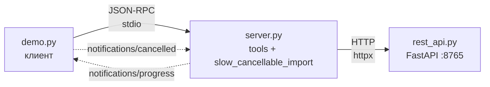
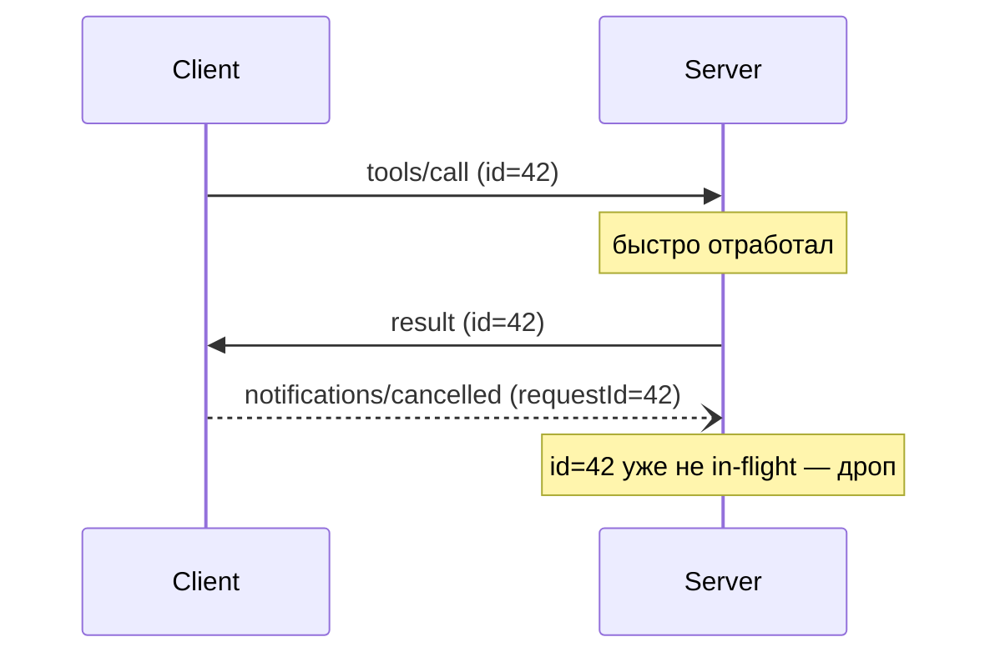
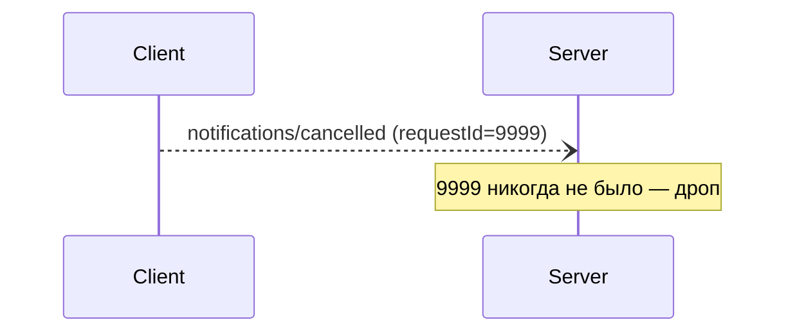
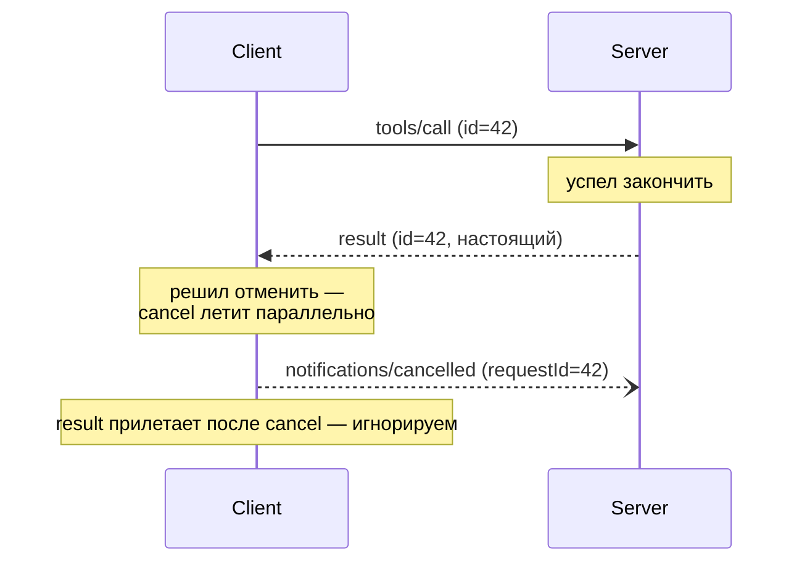

# 07 — Cancellation

**cancel — это способ сказать «я больше не жду ответ, можешь не делать»**. 

Особенности:

- **Один метод-имя на всю тему** — `notifications/cancelled`. В `params` кладётся `requestId` (это `id` того request'а, который мы отменяем) и опциональный `reason` — свободная строка для логов. Поле называется именно `requestId`, а не `id`, потому что у самой notification своего `id` по правилам JSON-RPC нет — так что «id, на который ссылаемся» и пришлось переименовать, чтобы не путать с собственным.
- Впервые **клиент** что-то шлёт серверу вне обычного request/response. В [06-notifications/](../06-notifications/) сервер инициировал четыре типа уведомлений; здесь в обратную сторону — клиент инициирует один тип. При этом cancel на уровне протокола **симметричен**: если сервер сам отправит request (например, `sampling/createMessage` из [08-sampling/](../08-sampling/)), отменить его будет он же — тем же самым `notifications/cancelled`, просто server→client. Правило простое: cancel шлёт тот, кто отправил исходный request.
- **Никакой capability negotiation**. Cancel «просто работает», когда обе стороны его реализуют. Ни флага в `initialize`, ни opt-in токена.
- `initialize` отменять нельзя — сессия ещё не поднята, обрывать там попросту нечего (MUST NOT).
- Для task-augmented запросов (новый experimental-механизм 2025-11-25) cancel идёт через **request** `tasks/cancel`, а не через эту notification. Про это — в [конце главы](#забегая-вперёд-taskscancel).

Всё остальное — детали реализации и race conditions.

## Топология

Та же, что в 06. Принципиальное отличие — стрелка теперь идёт ещё и в обратную сторону:



## Содержимое папки

```
07-cancellation/
├── pyproject.toml    # mcp, fastapi, uvicorn, httpx — те же, что в 06
├── rest_api.py       # копия из 06
├── server.py         # 06 + slow_cancellable_import с try/finally
├── demo.py           # handshake + старт тула + cancel + чтение финала
└── README.md         # этот файл
```


## Установка и запуск

```bash
uv sync
uv run python demo.py
```

`demo.py` сам поднимает `rest_api.py` в фоне и запускает `server.py` по stdio — тот же паттерн, что в [02-rest-wrapper/demo.py](../02-rest-wrapper/demo.py).

### Почему не Inspector

Inspector умеет **отлавливать** `notifications/cancelled`, но **отправлять** их — нет: в UI такой кнопки cancel нет. Единственное cancel-API наружу — это `tasks/cancel` (request для experimental Tasks, это **другой** механизм — см. [ниже](#забегая-вперёд-taskscancel)).

---

## Отменяем долгий tool

Берём `slow_cancellable_import` — это близнец `slow_bulk_import` из 06, но с одним добавлением: тело обёрнуто в `try/finally`, и в finally печатается, сколько задач успело создаться. Зачем — увидим в [Cancel ≠ undo](#cancel--undo).

`demo.py` гоняет за нас пять действий:

1. Handshake: `initialize` → response → `notifications/initialized`. Разбирали в [01-hello/](../01-hello/) — здесь пропускаем.
2. `tools/call` для `slow_cancellable_import(count=10)` с `progressToken`, `id=2`.
3. Читает два `notifications/progress` — этого хватает, чтобы убедиться, что тул реально работает.
4. Шлёт `notifications/cancelled` с `requestId=2` (тот же `id`, что у `tools/call`).
5. Читает, пока не придёт финальный ответ с `id=2`.

Ключое:

**tools/call с progressToken:**

```json
>>> {
  "method": "tools/call",
  "params": {
    "name": "slow_cancellable_import",
    "arguments": {"count": 10},
    "_meta": {"progressToken": "demo-cancel"}
  },
  "id": 2
}
```

**Два progress-уведомления от сервера (без `id`, server→client):**

```json
<<< {"method":"notifications/progress",
     "params":{"progressToken":"demo-cancel","progress":1,"total":10,"message":"Created task 1/10"}}
<<< {"method":"notifications/progress",
     "params":{"progressToken":"demo-cancel","progress":2,"total":10,"message":"Created task 2/10"}}
```

**После второго прогресса demo шлёт cancel:**

```json
>>> {
  "method": "notifications/cancelled",
  "params": {
    "requestId": 2,
    "reason": "demo: пользователь устал ждать"
  }
}
```

`requestId: 2` — тот же `id`, что у tools/call выше. `reason` — свободная строка для логов.

**И почти сразу сервер закрывает запрос error-ответом:**

```json
<<< {"id":2,"error":{"code":0,"message":"Request cancelled"}}
```

Плюс в stderr сервера появляется строчка — её `demo.py` перехватывает отдельно и печатает в самом конце:

```
[cleanup] slow_cancellable_import: created=2/10
```

Это сработал `try/finally` в теле тула — тот самый, ради которого всю главу и пишем. Две задачи успели создаться до отмены, и finally честно это зафиксировал.

<details>
<summary><b>Две детали, на которые стоит обратить внимание</b></summary>

**Спека хочет тишину, FastMCP отвечает.** По букве `cancellation.mdx` получатель **SHOULD NOT** слать response на отменённый request. FastMCP 1.27.0 шлёт — синтетический JSON-RPC error с невалидным `code: 0` и сообщением `Request cancelled`. Ровно та же привычка SDK, что мы видели в [03-errors/](../03-errors/) (всё подряд → `code: 0`) и в [06-notifications/](../06-notifications/) (capability declaration не выводится из реального состояния). Концептуально это «лучше дадим клиенту явное подтверждение, чем оставим в подвешенном состоянии», но букве спеки — поперёк.

**Кооперативная модель.** Cancel не магия и не сигнал, который преемптивно вырубает функцию посреди байт-кода. На сервере отмена прилетает в виде `anyio.CancelledError`, который поднимается на **ближайшем `await`**. То есть:

```python
for i in range(count):
    r = http.post("/tasks", json={...})    # синхронно — НЕ прерывается
    r.raise_for_status()                   # тоже синхронно
    await ctx.report_progress(...)         # ← здесь могут отменить
    await asyncio.sleep(0.5)               # ← или здесь
```

Если cancel прилетит, пока мы внутри `http.post(...)`, ничего не случится — POST доедет до конца, задача создастся, и только следующий `await` поднимет `CancelledError`. Никакого `ctx.is_cancelled()` или хука «при отмене вызови меня» в FastMCP нет — кооперация и есть весь интерфейс.

</details>

---

## Race conditions

Cancel — это `notifications/cancelled` без id, fire-and-forget. Между «клиент решил отменить» и «сервер начал отменять» болтается сетевая задержка, и из-за неё реально возможны три неловкие ситуации. Все три задизайнены в спеку как нормальные — никто их не «лечит», обе стороны просто умеют пожимать плечами.

### Cancel опоздал



Сервер уже ответил. Клиент успел нажать «отменить», но cancel прилетает в пустоту: в `_in_flight` такого id уже нет. Сервер тихо его выкидывает (спека: «MAY ignore if processing has already completed»). У клиента тоже всё нормально — в его таблице ожиданий ответ уже лежит.

### Cancel с неизвестным id



Клиент послал cancel на несуществующий запрос (баг в его таблице или просто фантазия). Спека ровно это и предусматривает: «MAY ignore if the referenced request is unknown». Сервер не отвечает ошибкой — а как бы он ответил? У notifications нет id, отвечать некуда.

### Cancel и response разъехались по времени

Это зеркало «cancel опоздал», только смотрим со стороны **клиента**. Сервер успел закончить и отправить настоящий `result` раньше, чем cancel до него долетел. Под капотом cancel и result разминулись — каждый уже в пути, но ещё не дошёл до получателя.



Спека пишет это правило именно под клиента: «sender of the cancellation notification SHOULD ignore any response to the request that arrives afterward». Правило стреляет даже когда приходит **настоящий `result`** с полноценными данными, а не cancel-error — сервер его отправил честно, просто не успел увидеть отмену. Клиент обязан всё равно выкинуть: раз уже отменил — запрос мёртв, а иначе модель начнёт работать на ответ, который по её же собственным намерениям уже не ждали.

Та же физика, что у «cancel опоздал», лечится с двух сторон: **сервер** молча игнорирует поздний cancel, **клиент** молча игнорирует поздний response. Типовой источник тонких багов — забыть про вторую половину и обрабатывать всё, что пришло с in-flight `id`, как будто cancel'а не было.

**Главный вывод:** все три случая — нормальная часть протокола. Не пытайся «починить race conditions» в своём сервере — они вшиты в дизайн notifications. Достаточно, чтобы код переживал их, не падая.

---

## Cancel ≠ undo

Самая важная мысль главы. После шага 1 в нашем REST-сервисе осталось **3 созданных задачи** — никто их не удалил, никто не откатил. Cancel говорит «**перестань делать новое**», а не «**откати то, что сделал**». Если посередине тула уже произошёл побочный эффект — его последствия остаются.

Отсюда две практики:

**1. `try/finally` для уборки.** `CancelledError` — обычное исключение, `finally` на нём отработает. Туда кладём `db.rollback()`, `lock.release()`, чекпойнт — всё, что должно оставить мир в консистентном состоянии. В `slow_cancellable_import` именно для этого стоит try/finally с `print` — в реальном коде был бы rollback.

**2. Идемпотентность.** Если шаг необратим (отправили email, списали деньги, пушнули в downstream), сделай его безопасным к повтору: idempotency-key, дедупликация на стороне сервиса, чекпойнт в БД. Не специфика MCP — общий паттерн, но cancel вытаскивает его на первый план.

Правило одной строкой: «полузаписанные» данные после cancel — это баг тула, а не отмены.

---

## Откуда берутся cancel'ы в реальной жизни

Не от того, что пользователь нажал кнопку (хотя и это тоже). Главный источник — **таймауты**. Из [`lifecycle.mdx`](https://github.com/modelcontextprotocol/modelcontextprotocol/blob/main/docs/specification/2025-11-25/basic/lifecycle.mdx#timeouts):

> When the request has not received a success or error response within the timeout period, the sender SHOULD issue a cancellation notification for that request and stop waiting for a response.

То есть стандартный паттерн внутри клиента — это:

1. Поставить таймаут на каждый исходящий request.
2. Когда таймаут вышел — отправить `notifications/cancelled` и считать запрос мёртвым.
3. (опционально) Сбрасывать таймер при получении `notifications/progress` — раз сервер шлёт прогрессы, значит работает; но max-timeout всё равно держать, чтобы зависший сервер не висел вечно.

Это связка с [06-notifications/](../06-notifications/) в одну картинку: **`progress` говорит «я ещё жив», `cancelled` говорит «ты уже слишком долго»**. Одна и та же notification-плоскость закрывает обе ниши — наблюдение за прогрессом и обрыв висяка.

В Python SDK это видно прямо в коде клиента: `send_request` принимает `read_timeout_seconds`, по таймауту бросает `MCPError(REQUEST_TIMEOUT, ...)`. Cancel-notification сам по себе при этом SDK **не шлёт** — это надо сделать руками через `client.session.send_notification(CancelledNotification(...)).

---

## Забегая вперёд: tasks/cancel

В ревизии 2025-11-25 появился **отдельный** механизм отмены — `tasks/cancel`. Зачем он нужен и почему это **не** notification:

- Tasks — это experimental-примитив для долгих асинхронных операций, который выдаёт `taskId` и живёт между сессиями (в духе job-API). У них своя capability `tasks` в `initialize`.
- Отмена task — это **request** с response, не notification. Запрашивающий получает обратно `Task` с финальным `status: "cancelled"` и подтверждение, что отмена принята.
- Если task уже терминальный (`completed`/`failed`/`cancelled`) — `-32602`, нельзя отменить то, что уже завершилось.

То есть для классического request/response мира — `notifications/cancelled` (эта глава). Для tasks-мира — `tasks/cancel` с подтверждением.

Подробно про tasks как примитив и про SEP-1686, из которого они выросли, — в [appendix/a2a/](../../appendix/a2a/), там это сравнивается с Agent-to-Agent протоколом Google.

---

## Что попробовать

1. **Другой момент отмены.** В `demo.py` поменяй `STOP_AFTER_PROGRESSES = 2` на `5` и `count=10` на `count=20`. Запусти. В финальной строке `[cleanup] created=N/20` увидишь, сколько задач реально дожило до cancel — число обычно совпадает с номером последнего прочитанного `progress`, но может оказаться на 1 больше из-за гонки: cancel попал в ближайший `await` между http.post и report_progress, POST уже прошёл.

2. **Cancel неизвестного id.** В `demo.py` поменяй `"requestId": CALL_ID` на `"requestId": 9999` в шаге 4. Запусти. Сервер cancel тихо дропает (id=9999 не in-flight), тул докатывается до конца — в финале придёт обычный успешный `result: Imported 10 tasks.` вместо error. Спека: «MAY ignore if the referenced request is unknown» — ровно оно.

3. **Сломать кооперацию.** Замени `await asyncio.sleep(0.5)` в `slow_cancellable_import` на блокирующий `time.sleep(0.5)` (не забудь `import time` сверху). Запусти `demo.py` ещё раз — cancel долетит, но тул всё равно докатится до конца со всеми 10 задачами и обычным успешным `result`. Между блокирующими `time.sleep` нет ни одного `await` checkpoint, отмене негде сработать. Хороший аргумент против блокирующего кода в async-серверах вообще.

4. **Съесть отмену.** Оберни тело try-блока в `except BaseException: pass` (вместо `except Exception`). Cancel доходит, исключение перехватывается, тул возвращает «успех», как будто ничего не случилось. Не баг — антипаттерн. Полезно один раз сделать, чтобы запомнить.

---

## Что разобрали

- **Один notification, без capability.** `notifications/cancelled` с `requestId` — единственный механизм для классических request/response. Никаких флагов в handshake.

- **Кооперативная модель отмены.** На стороне сервера cancel приходит как `anyio.CancelledError` на ближайшем `await`. Между awaits отменять нельзя — синхронный код доедет до конца. Никакого хука «при отмене», никакого `ctx.is_cancelled()` в FastMCP — только сама природа async.

- **Race conditions встроены в дизайн.** Cancel может опоздать, может ссылаться на неизвестный id, может разъехаться с response по времени. Спека требует, чтобы обе стороны это пережили — игнорированием. Не нужно их «чинить».

- **Cancel ≠ undo.** Это «перестань делать новое», не «откати сделанное». `try/finally` для уборки, не глотай `BaseException`, делай шаги идемпотентными там, где они необратимы.

- **Откуда cancel в природе.** Чаще всего — таймауты со стороны клиента. Связка с прогрессом из 06: `progress` = «жив», `cancelled` = «слишком долго».

- **FastMCP 1.27.0 vs спека.** Третий раз подряд то же расхождение: SDK на отменённый request шлёт error с невалидным `code: 0`, хотя спека требует тишины. На работу клиента это не влияет, но в строгих сертификационных харнессах будет вопросом.

- **`tasks/cancel` — отдельная история.** Для async-tasks (experimental в 2025-11-25) есть свой механизм через request с подтверждением. Разбирается в appendix про A2A.

Дальше — [`08-sampling/`](../08-sampling/): первый раз, когда **сервер** шлёт **request** клиенту. Симметрия из §3 главного README перестаёт быть теорией.
